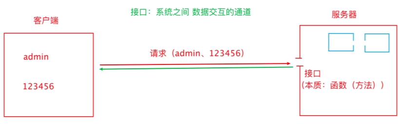
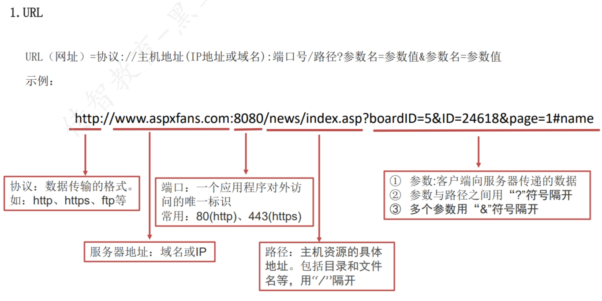
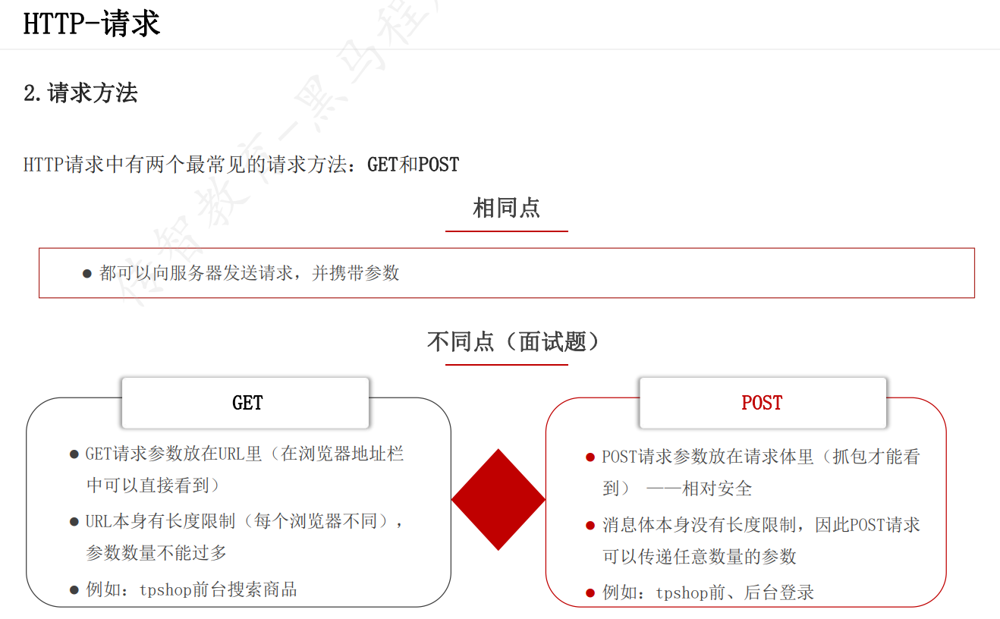
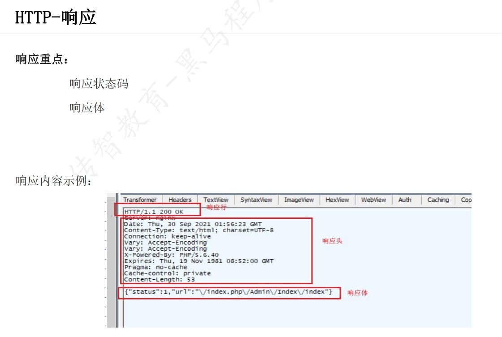
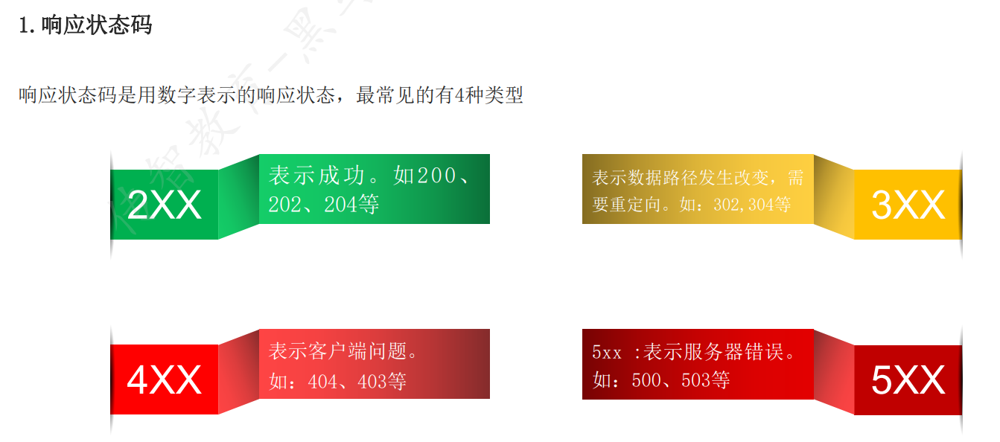
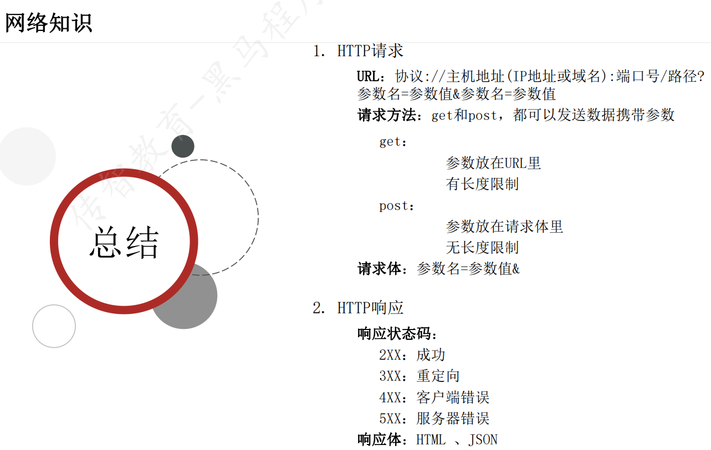

# 接口测试理论

## 概念：
接口：系统之间(外部系统与内部系统，内部系统与内部系统)数据交通的通道
接口测试：校验接口回发的响应数据与预期结果是否一致

接口测试,可以绕过前端页面。直接对服务器进行请求

## 价值：
* 可以发现页面发现不了的问题
* 符合质量控制前移理论
* 低成本高收益
## 实现方式
* 工具
  * postman：简单，功能少
  * jmeter：复杂，功能多
* 代码
  * python + request + Unittest
  * java + HttpClient

## Http协议
    协议就是规则，严格遵守
### http协议简介
* 超文本传输协议，基于请求与响应的应用层协议
* 特点：
  1. 客户端
  2. 简单快速
  3. 灵活
  4. 无连接
  5. 无状态
### URL格式
**URL组成：协议://hostname[:port]/path/([?查询参数1&查询参数2])**

完整语法格式：协议://IP地址:端口号/资源路径?查询参数

***Get请求和POST请求的区别***

***HTTP-响应***

***响应状态码***

*网络状态总结*
