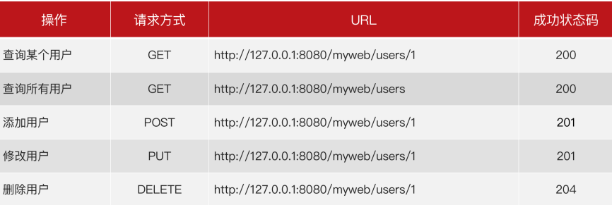

## **接口测试流程**
* 需求分析（产品经理的需求⽂档）
* 接⼝⽂档解析（开发编写的 接⼝API⽂档）
* 设计 接⼝测试⽤例（编写 Excel 表格形式的⽤例）
* 准备接⼝测试脚本
  * postman ⼯具 ⽣成脚本
  * python 代码 编写脚本
* 执⾏测试⽤例，跟踪缺陷
* ⽣成 接⼝测试报告
* 接⼝⾃动化持续集成（可选）
********
# 接口测试理论
### 概念：
接口：系统之间(外部系统与内部系统，内部系统与内部系统)数据交通的通道 <br>
接口测试：校验接口回发的响应数据与预期结果是否一致,接口测试,可以绕过前端页面。直接对服务器进行请求<br>
<br>
### 价值：
* 可以发现页面发现不了的问题
* 符合质量控制前移理论
* 低成本高收益
### 实现方式
* 工具
  * postman：简单，功能少
  * jmeter：复杂，功能多
* 代码
  * python + request + Unittest
  * java + HttpClient
### Http协议
    协议就是规则，严格遵守
#### http协议简介
* 超文本传输协议，基于请求与响应的应用层协议
* 特点：
  1. 客户端
  2. 简单快速
  3. 灵活
  4. 无连接
  5. 无状态
#### URL格式
**URL组成：协议://hostname[:port]/path/([?查询参数1&查询参数2])**<br>
完整语法格式：协议://IP地址:端口号/资源路径?查询参数
* 协议:
  * http、https作用：指定数据传输规则
* IP地址：
  * 也就是域名。作用：在网络环境中，唯一定位一台主机
* 端口号：
  * 作用：在主机上，唯一定义一个应用程序
  * 可以省略。如果省略，跟随协议。http -80  https - 443
* 资源路径：
  * 作用：应用对应的数据资源
  * 可以省略。如果省略,资源路径为"/"
* 查询参数：
  * 作用：给资源传递参数
  * 可以省略。如果省略，没有？分隔符
  * 可以有多组。每组k = v格式。各组之间用"&"分隔<br>

**练习：**
请写出以下URL的各个组成部分。这个URL没有写出端⼝号，它的端⼝是什么?<br>
`http://tpshop-test.itheima.net/index.php?m=Home&c=User&a=do_login`
1. 协议：http
2. ip地址：tpshop-test.itheima.net 定位主机名
3. 端口号：http协议默认80，可以不显示 https-443
4. 资源路径：定位资源路径
5. 参数：m=Home&c=User&a=do_login
________
### HTTP请求
产生端：
* 一定产生与客户端。当客户端给服务器发送请求时，使用该协议。（请求报文、请求包）
#### 整体格式
* 请求行：请求方法、URL、协议版本
* 请求头：K：V
* 空行：代表请求头结束
* 请求体：发送给服务器请求时，携带的数据<br>
<br>
【示例】：
```
POST http://demo.zentao.net/user-login.html HTTP/1.1
Host: demo.zentao.net
User-Agent: Mozilla/5.0 (Windows NT 10.0; Win64; x64; rv:68.0) Gecko/20100101
Firefox/68.0
Accept: text/html,application/xhtml+xml,application/xml;q=0.9,*/*;q=0.8
Accept-Language: zh-CN,zh;q=0.8,zh-TW;q=0.7,zh-HK;q=0.5,en-US;q=0.3,en;q=0.2
Accept-Encoding: gzip, deflate
Referer: http://demo.zentao.net/user-login.html
Content-Type: application/x-www-form-urlencoded
Content-Length: 54
Connection: keep-alive
Upgrade-Insecure-Requests: 1

account=demo&password=efc4a3b32e48054865e5a8321cfda3e4
```
#### 请求行
* 一定位于http请求协议的，第一行。格式请求方法（空格）URL（空格）协议版本
* 请求方法：
  * GET：查询 ---没有请求体
  * POST：添加（注册、登录）
  * DELETE: 删除 -- 没有请求体
  * PUT：修改
* URL：见上部
* 协议版本：常见HTTP/1.1
#### 请求头
* 位于请求行之下，空行之上的部分。数据格式一定是K：V对
* Content-Type: 作用，指定请求体的数据类型
  * application/json: 请求体数据类型为json
  * applicatin/x-www-form-urlencoded：请求体数据类型为表单类型
#### 请求体
* 位于空行之下
* 有的请求协议没有请求体。get 、delete
* 请求体的数据类型，受请求头中Content-Type的值影响
#### 练习1
* 以下是抓取的某个HTTP协议数据包的请求报⽂，请问其中，请求⾏，请求头，请求体分别是什么？
```raw
POST http://192.168.19.49/tdkcgi HTTP/1.1
Host: 192.168.19.49
Connection: keep-alive
Content-Length: 281
Accept: application/xml, text/xml, */*; q=0.01
X-Requested-With: XMLHttpRequest
User-Agent: Mozilla/5.0 (Windows NT 10.0; Win64; x64) AppleWebKit/537.36 (KHTML, like Gecko) Chrome/124.0.0.0 Safari/537.36
Content-Type: application/xml
Origin: http://192.168.19.49
Referer: http://192.168.19.49/preview.html
Accept-Encoding: gzip, deflate
Accept-Language: zh-CN,zh;q=0.9

<?xml version="1.0" encoding="utf-8"?><envelope><header><security>usernametoken</security><username>admin</username><password></password><nc>bOmhBfPJ63OONA1OvD8Ml9q6qXPt3thg</nc></header><body><command>g.ch.ability</command><content><channel>1</channel></content></body></envelope>
```
1. 请求行：
`POST http://192.168.19.49/tdkcgi HTTP/1.1`
2. 请求头:
```raw
Host: 192.168.19.49
Connection: keep-alive
Content-Length: 281
Accept: application/xml, text/xml, */*; q=0.01
X-Requested-With: XMLHttpRequest
User-Agent: Mozilla/5.0 (Windows NT 10.0; Win64; x64) AppleWebKit/537.36 (KHTML, like Gecko) Chrome/124.0.0.0 Safari/537.36
Content-Type: application/xml
Origin: http://192.168.19.49
Referer: http://192.168.19.49/preview.html
Accept-Encoding: gzip, deflate
Accept-Language: zh-CN,zh;q=0.9
```
3. 请求体:
```xml
<?xml version="1.0" encoding="utf-8"?><envelope><header><security>usernametoken</security><username>admin</username><password></password><nc>bOmhBfPJ63OONA1OvD8Ml9q6qXPt3thg</nc></header><body><command>g.ch.ability</command><content><channel>1</channel></content></body></envelope>
```
* 请求体数据类型为xml
### HTTP响应
产生端：
* 一定产生于服务端。当服务器接受到http请求协议后，才会产生http响应协议（响应报文、响应包）。
#### 整体格式
* 响应行：协议版本、状态码、状态码描述。
* 相应头：K:V格式数据。
* 空行：代表相应头结束。
* 响应体：服务回发给客户端的数据。几乎所有的响应包，都有响应体。<br>
<br>
【示例】：
```raw
HTTP/1.1 200 OK
Date: Fri, 22 May 2009 06:07:21 GMT
Content-Type: text/html; charset=UTF-8
<html>
 <head></head>
 <body>...</body>
</html>
```
#### 状态行
* 一定位于http响应协议的第一行。格式：协议版本（空格）状态码（空格）状态码描述
* 状态码：5类：
  * 1XX：指示信息
  * **2XX: 成功**
  * 3XX: 重定向
  * **4XX：客户端错误**
  * 5XX: 服务端错误<br>

#### 响应头
* 位于响应行之下，空行之上的部分。数据格式一定是K：V对
#### 响应体
* 位于空行之下
* 几乎所有响应协议都有响应体
* 响应体中包含的数据，是接口测试过程中，所要使用的**实际结果**！！
```raw
HTTP/1.1 200 OK
Server: nginx
Date: Mon, 29 Jun 2020 03:36:28 GMT
Content-Type: text/html; charset=UTF-8
Connection: keep-alive
Set-Cookie: is_mobile=0; expires=Mon, 29-Jun-2020 04:36:28 GMT;
Expires: Thu, 19 Nov 1981 08:52:00 GMT
Content-Length: 805
{"status":1,"msg":"\u767b\u9646\u6210\u529f","result":
{"user_id":3338,"email":"","password":"519475228fe35ad067744465
c42a19b2","paypwd":null,"sex":0,"birthday":0,"user_money":"0.00
","frozen_money":"0.00","distribut_money":"0.00","underling_num
ber":0,"pay_points":100,"address_id":0,"reg_time":1590980161,"l
ast_login":1590980161,"last_ip":"","qq":"","mobile":"1380013800
6","level_name":"\u6ce8\u518c\u4f1a\u5458"},"url":""}
```
状态行：
`HTTP/1.1 200 OK`<br>
响应头：
```raw
Server: nginx
Date: Mon, 29 Jun 2020 03:36:28 GMT
Content-Type: text/html; charset=UTF-8
Connection: keep-alive
Set-Cookie: is_mobile=0; expires=Mon, 29-Jun-2020 04:36:28 GMT;
Expires: Thu, 19 Nov 1981 08:52:00 GMT
Content-Length: 805
```
响应体：
```json
{"status":1,"msg":"\u767b\u9646\u6210\u529f","result":
{"user_id":3338,"email":"","password":"519475228fe35ad067744465
c42a19b2","paypwd":null,"sex":0,"birthday":0,"user_money":"0.00
","frozen_money":"0.00","distribut_money":"0.00","underling_num
ber":0,"pay_points":100,"address_id":0,"reg_time":1590980161,"l
ast_login":1590980161,"last_ip":"","qq":"","mobile":"1380013800
6","level_name":"\u6ce8\u518c\u4f1a\u5458"},"url":""}
```
*****
### 接口规范
#### 传统风格接口
* 接⼝统⼀采⽤ get/post 实现 所有操作。
* URL 与 资源不是 ⼀⼀对应的。在 URL 中查看出，是何种操作
* 状态码统⼀ 返回 200<br>

#### Restful风格接口
* 接⼝使⽤的⽅法，与 http协议的 请求⽅法，⼀⼀对应。
* get - 查、post - 增、put - 改、delete - 删
* URL 与 资源 ⼀⼀对应！不能从 URL 中，看出 是 何种操作。 需要通过 结合 请求⽅法 来识别何种操作。
* 响应状态码 使⽤较为全⾯。<br>

#### 小结
* 传统风格的接口：只⽤ get、post⽅法。 URL 不唯⼀。 统⼀返回 200
* Restful⻛格接⼝：URL 唯⼀，定位资源。结合 请求⽅法对应不同操作。 返回状态码 较灵活。<br>

--------
### Get请求和POST请求的区别<br>
***HTTP-请求***<br>
<br>
***HTTP-响应***<br>
<br>
***响应状态码***
<br><br>
***网络状态总结***
<br>