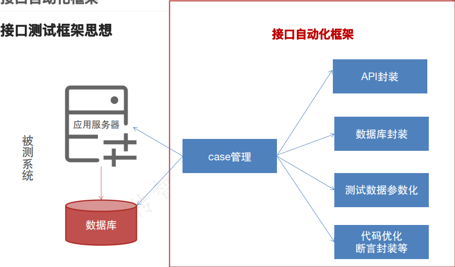
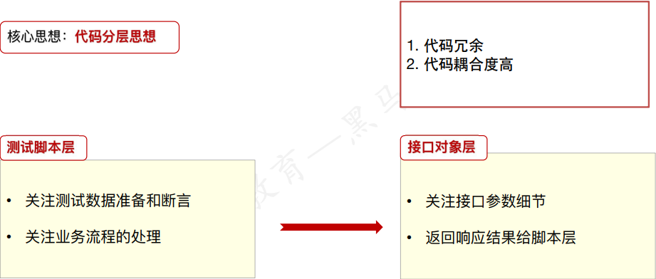
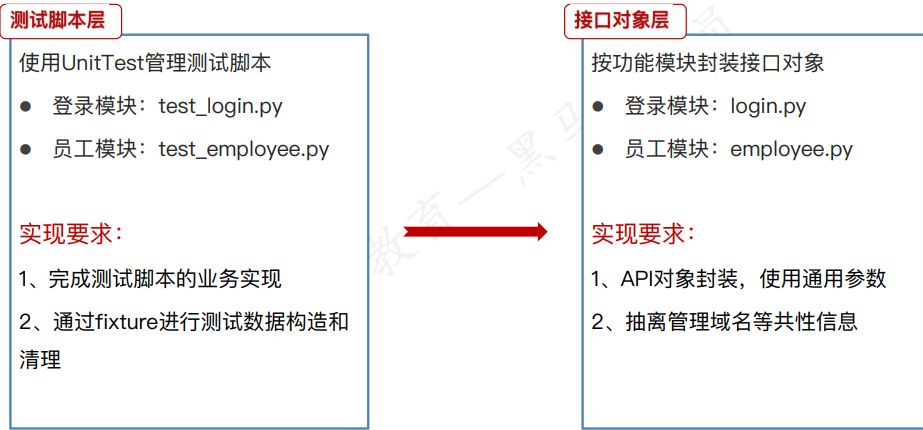

## 接口自动化测试框架开发
* 接口自动化框架设计思路
* 接口自动化测试框架开发实现
## 接口自动化框架
### 接口测试框架思想

### 接口自动化框架设计思路
1. 搭建基础框架：定义项目目录结构,安装依赖包
2. 通用功能类封装：数据库工具类
3. 用例基础代码：封装接口API对象+UnitTest框架编写测试脚本
4. 测试数据参数：测试数据json文件设计、参数化实现
5. 用例组织运行：组织测试用例运行,生成测试报告
***
#### 搭建基础框架--定义项目目录结构
+ api
  + 定义封装被测系统的接口
+ scripts
  + 定义测试用例脚本
+ data
  + 存放测试数据文件
+ report
  + 存放生成的测试报告
+ common
  + 存放通用工具类
+ config.py
  + 定义项目的配置信息
+ run_suite.py
  + 执行测试套件的入口
#### 一、搭建基础框架--安装依赖包
+ 安装requests包
+ 安装parameterized包
+ 安装PyMySQL包
+ 安装htmlTestReport包
#### 二、封装数据库操作工具类
**实现的功能：**
1. 获取数据库连接对象方法
   * get_conn()
2. 关闭数据库连接对象
   * close_conn()
3. 查询一条记录
   * get_one()
4. 更新数据库
   * uid_db()
#### 三、用例基础代码--API对象封装+测试脚本
**核心思想代码分层：** 

#### 四、测试数据参数化
#### 五、生成测试报告

