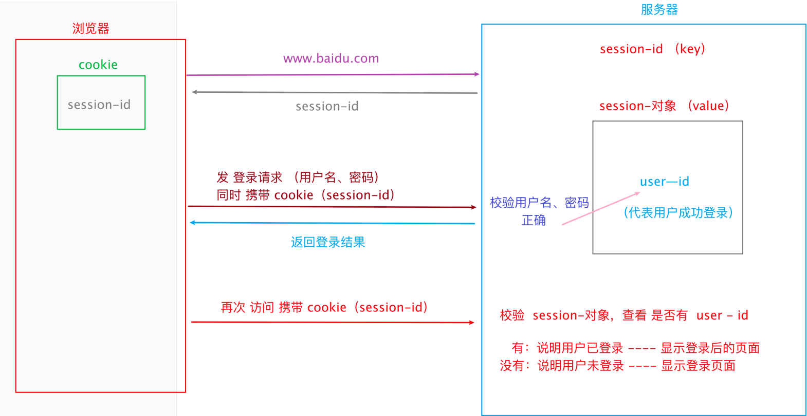

## Cookie
*******************
### Cookie简介
* 简介：工程师 针对 http协议是无连接、无状态特性，设计的 一种技术。 可以在浏览器端 存储用户的信息。
* 特性：
  * cookie用于存储用户临时不敏感的信息
  * cookie位于浏览器（客户端）端。默认4K左右（可以调整）
  * cookie中的数据，可以随意被访问，没有安全性可言
  * cookie中存储的数据类型，受浏览器限制
### Cookie + Session认证方式
在计算机中，认证用户身份的方式有多种
* ihrm项目：token认证
* tpshop项目：cookie + Session 认证 
 
### ==Session==
Session简介 
简介：也叫会话。通常出现在网络通信中，从客户端借助访问终端登录上服务器，直到退出登录所产生的通信数据，保存在会话中。
 特性：
* Session 用于存储 用户的信息。
* Session 位于服务端。大小直接使用服务器存储空间
* Session 中的数据，不能随意被访问，安全性较高。
* Session 中存储的数据类型，受服务器影响，几乎能支持所有的数据类型。
* Session 自动管理Cookie因为 Cookie 中的 数据，都是 Session 传递的。因此，Session 可以直接 自动管理 cookie
------
### 面试题 Cookie 和 Session 区别
1. 数据存储位置： 
cookie存储在浏览器；session存储在服务器。
2. 安全性： 
cookie中的数据可以随意获取，没有安全性可言。Session的数据多为加密存储，安全较高！
3. 数据类型： 
cookie支持的数据类型受浏览器限制，较少；Session直接使用服务器存储，支持所有数据类型
4. 大小： 
cookie大小默认 4k； Session 大小约为服务器存储空间大小
-----
**== 获取指定响应数据常用 ==** 
* 获取 URL：resp.url
* 获取 响应状态码：resp.status_code
* 获取 Cookie：resp.cookies
* 获取 响应头：resp.headers
* 获取 响应体：
  * 文本格式：resp.text
  * json格式：resp.json()