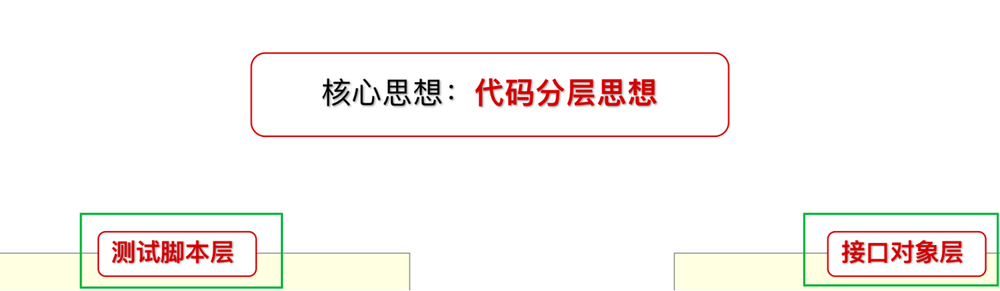

## 接⼝对象封装 
## 解决了哪些问题
********
+ 代码冗余度高
+ 代码耦合度高
+ 代码维护成本高

**核心思想：代码分层** 
 
* 分层思想：
  * 将普通方法实现的，分为接口对象层和测试脚本层
* 接口对象层：
  * 对接口进行封装。封装好后，给测试用例层调用
  * 面向对象 类封装实现
* 测试用例层：
  * 调用接口对象层封装的方法，拿到响应结果，断言进行接口测试
  * 借助unitest框架实现
*******
## 封装TPShop商城
`见python代码`