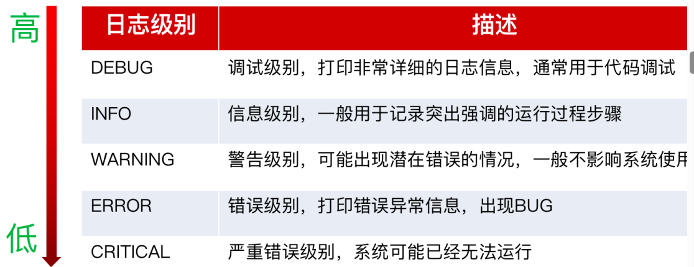
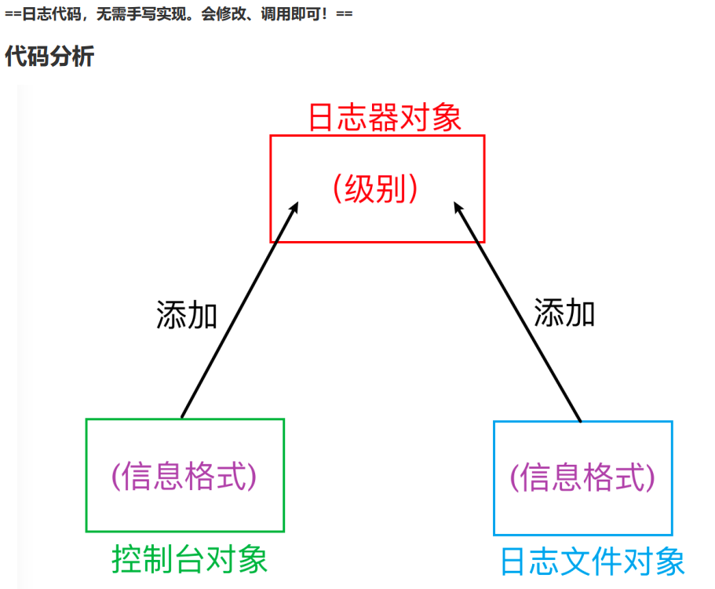
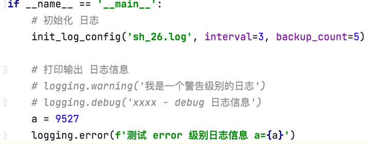
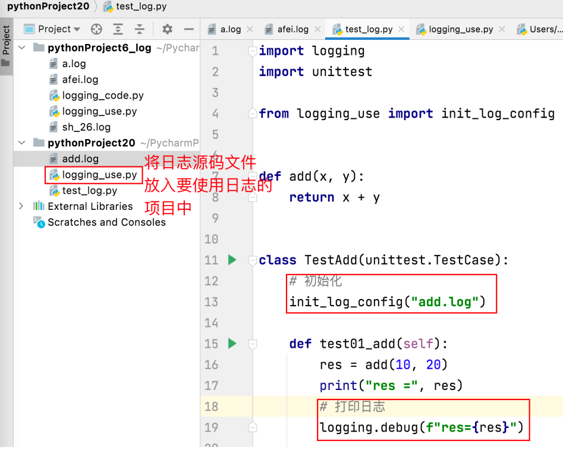

## 日志收集
****
### == 日志简介 ==
****
* 什么是日志
  * 日志也叫log，通常对应的 xxx.log 的日志文件。文件的作用是记录系统运行过程中，产生的信息。
* 收集日志的作用
  * 查看系统运行是否正常
  * 分析、定位bug
### 日志的级别
* logging.DEBUG：调试级别【高】
* logging.INFO：信息级别【次高】
* logging.WARNING：警告级别【中】
* logging.ERROR：错误级别【低】
* logging.CRITICAL：严重错误级别【极低】
特性：
* 日志级别设定后，只有比该级别低的日志会写入日志。
  * 如：设定日志级别为 info。 debug 级别的日志信息，不会写入。infowarning、error、critical 会写入
<br><br>
### 日志代码实现分析
<br><br>

```txt
# 0. 导包
# 1. 创建日志器对象
# 2. 设置日志打印级别
# logging.DEBUG 调试级别
# logging.INFO 信息级别
# logging.WARNING 警告级别
# logging.ERROR 错误级别
# logging.CRITICAL 严重错误级别
# 3. 创建处理器对象
# 创建 输出到控制台 处理器对象
# 创建 输出到日志文件 处理器对象
# 4. 创建日志信息格式
# 5. 将日志信息格式设置给处理器
# 设置给 控制台处理器
# 设置给 日志文件处理器
# 6. 给日志器添加处理器
# 给日志对象 添加 控制台处理器
# 给日志对象 添加 日志文件处理器
# 7. 打印日志
```

### ==日志使用==
### 可修改的位置
使用步骤：
1. 调用 init_log_config() 函数，初始化日志信息。
2. 指定 日志级别，打印 日志信息。
<br><br>
<br><br>