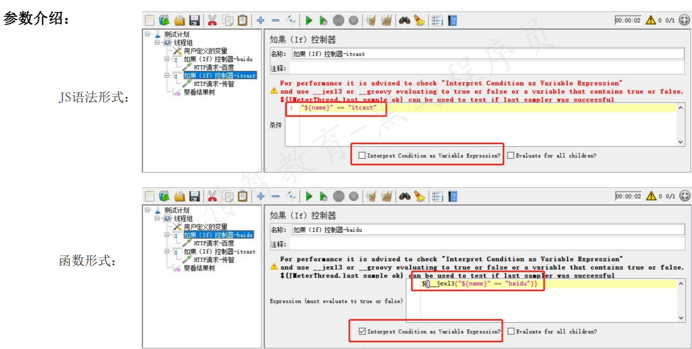
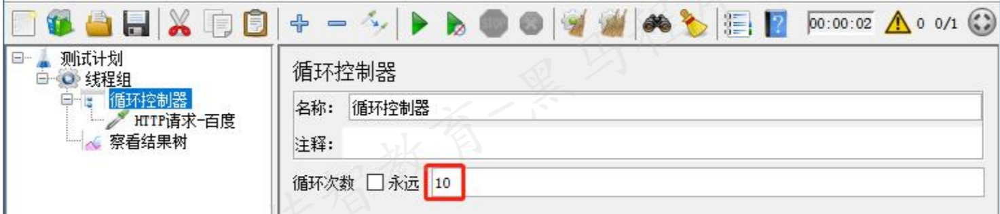

## Jmeter常用的逻辑控制器
* 逻辑控制器:可以按照设定的逻辑控制器取样器的执行顺序
* Jmeter中常用的逻辑控制器:
  - 如果IF控制器
  - 循环控制器
  - ForEach控制器
***
### IF控制器
* 作用:If控制器用来控制它下面的测试元素是否运行
* 位置:测试计划 --> 线程组--> (右键添加) 逻辑控制器 --> 如果（If）控制器
* 参数介绍:
  * JS语法形式:**不需要**勾选`Interpret Condition as Variable Expression`
  * 函数形式：需要勾选 `Interpret Condition as Variable Expression` 

1. IF控制器的作用是什么？
   * 用来控制它下面的测试元素是否运行
2. 使用“IF控制器”的操作步骤？
   1. 添加线程组
   2. 用户定义的变量
   3. 添加If控制器，判断name是否等于baidu
      * 不勾选Interpret Condition，'${name}' == 'baidu‘
      * 勾选，${__jexl3('${name}' == 'baidu',)}
   4. 添加HTTP请求，用来访问百度
   5. 添加If控制器，判断name是否等于itcast
   6. 添加HTTP请求，用来访问传智播客
   7. 添加查看结果树
***
### 循环控制器
* 作用:通过设置循环次数，来实现循环发送请求
* 位置:测试计划 --> 线程组--> (右键添加) 逻辑控制器 --> 循环控制器
* 参数介绍: 
 
1. 循环控制器的作用是什么？
   * 通过设置循环次数，来实现循环发送请求
2. 使用“循环控制器”的操作步骤？
   1. 添加线程组
   2. 添加循环控制器 —— 设置循环次数
   3. 添加HTTP请求
   4. 添加查看结果树
3. 思考：线程组属性可以控制循环次数，那么循环控制器有什么用？
*** 
### Foreach控制器
* 作用：
  * 一般和用户自定义变量或者正则表达式提取器一起使用，读取返回结果中一系列相关的变量值。
  * 该控制器下的取样器都会被执行一次或多次，每次读取不同的变量值。
* 位置:
  * 测试计划 --> 线程组--> (右键添加) 逻辑控制器 --> ForEach控制器
* 参数介绍:
  - 入变量前缀：要读取的输入变量的固定前缀
  - 开始循环字段：要读取的输入变量后缀数字的最小值-1
  - 结束循环字段：要读取的输入变量后缀数字的最大值
  - 输出变量名称：读取输入变量的值后保存的新变量名，用于后续HTTP请求来引用
1.  ForEach控制器的作用是什么？
   * 一般和用户自定义变量或者正则表达式提取器一起使用，读取返回结果中一系列相关的变量值
2. 使用“ForEach控制器”的操作步骤？
   1. 添加线程组
   2. 添加用户定义的变量/正则表达式提取器
      * 返回一组变量: 相同的变量名+连续的数字后缀，如：name_1..name_3
   3. 添加ForEach控制器
      * 输入变量前缀：要读取的输入变量的固定前缀,如：name
      * 开始循环字段：要读取的输入变量后缀数字的最小值-1，如：0
      * 结束循环字段：要读取的输入变量后缀数字的最大值，如：3
      * 输出变量名称：读取输入变量的值后保存的新变量名，如word
   4. 添加HTTP请求-百度
      * 引用ForEach控制器中保存的新变量名，如：${word}
   5. 添加查看结果树
