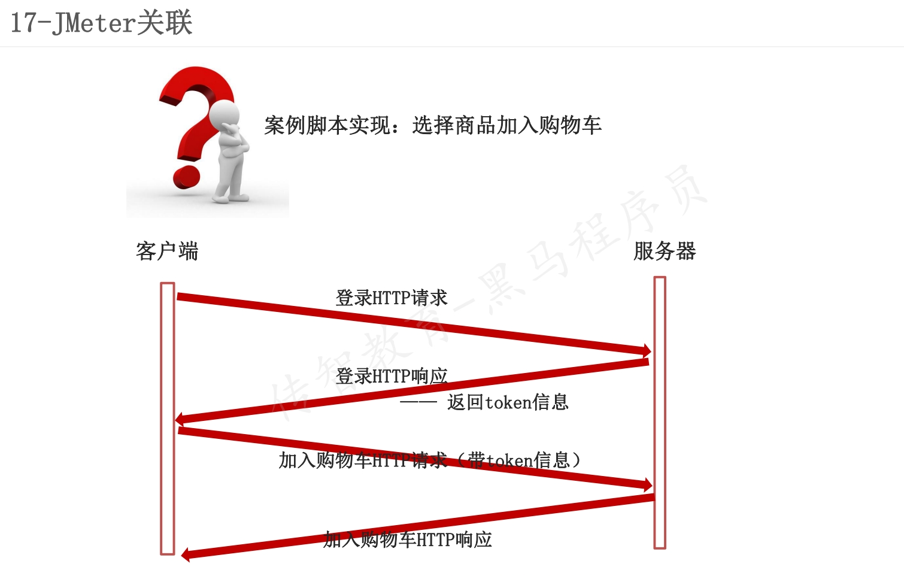

## Jmeter关联
### 案例
 
1. **关联:**当请求之间有**依赖关系**时,比如一个请求的入参是另一个请求返回的数据，这时候就需要用到关联处理。
2. Jmeter中常用的关联方法
   - 正则表达式提取器
   - Xpath提取器
   - JSON提取器
#### 正则表达式提取器
* 作用：针对任意格式的响应数据进行提取
* 位置：测试计划 --> 线程组--> HTTP请求 --> (右键添加) 后置处理器 --> 正则表达式提取器
* 参数介绍
  - 引用名称：存放提取出的值的参数名称，供下一个请求引用，如填
  写title，则可用${title}引用它
  - 正则表达式: 左边界(.*?)右边界
  '()'：括起来的部分就是要提取的。
  '.'：匹配任何字符串。
  '*'：0次或多次。
  '?'：不要太贪婪，在找到第一个匹配项后停止。
  - 模板：用$$引用起来，如果在正则表达式中有多个提取值，则可以是$2$$3$等等，表示解析到的第几个值给title。如：$1$表示解析到的第1个值
  - 匹配数字：0代表随机取值，-1代表全部取值，1代表取第一个值
  - 缺省值：如果参数没有取得到值，那默认给一个值让它取。
#### Xpath提取器
1. 什么时候可以使用XPATH提取器？
   * 针对HTML格式的响应数据，可以使用XPATH提取器进行提取
2. 使用“Xpath提取器”的操作步骤？
   1. 添加线程组
   2. 添加HTTP请求-传智播客
   3. 添加XPATH提取器
      * 勾选Use Tidy (tolerant parser)
        * 当需要处理的页面是HTML格式时，必须选中该选项
        * 当需要处理的页面是XML或XHTML格式时，取消选中该选项。
      * 引用名称：存放提取出的值的参数名称。如：填写title
      * XPath Query：用于提取值的XPath表达式
      * 匹配数字：0：表示随机，-1：表示提取所有结果，1表示第一个值
   4. 添加HTTP请求-百度
      * 引用正则表达式中的引用名称。如：用${title}引用它
   5. 添加查看结果树
#### jSON提取器
1. 什么时候可以使用JSON提取器？
   * 针对JSON格式的响应数据，可以使用JSON提取器进行提取
2. 使用“JSON提取器”的操作步骤？
   1. 添加线程组
   2. 添加HTTP请求-天气
   3. 添加JSON提取器
      * Names of created variables：存放提取出的值的参数名称。如：city
      * JSON Path Expressions：用于提取值的JSON路径表达式
      * Match No： 0：表示随机，-1：表示提取所有结果，1表示第一个值
   4. 添加HTTP请求-百度
      * 引用正则表达式中的引用名称。如：用${city}引用它
   5. 添加查看结果树
***
### Jmeter属性
* 当有关联关系的两个请求在同一个线程组中时可以使用三种提取器的变量来实现数据传递
* 当有关联关系的两个请求在不同的线程组中时如何,如何进行数据传递  -- Jmeter属性
#### Jmeter属性的配置函数
* __setProperty函数:将值**保存**成**JMeter属性**
* __property函数:在其他线程组中使用property函数**读取属性**
* JMeter函数的执行:
  * __setProperty函数执行(保存JMeter属性): 需要通过BeanShell取样器来执行
  * __property函数(读取属性): 在其他线程组中使用property函数
1. 什么时候需要使用JMeter属性？
• 需要实现跨线程组的数据传递时，可以使用JMeter属性
2. 使用“JMeter属性”的操作步骤？
   1. 添加线程组1
   2. 添加HTTP请求-天气
   3. 添加JSON提取器
   4. 添加BeanShell取样器（将JSON提取器提取的值保存为JMeter属性）
      * 保存JMeter属性：${__setProperty(pro_city,${city},)}
   5. 添加线程组2
   6. 添加HTTP请求-百度（读取JMeter属性）
      * 读取JMeter属性：${__property(pro_city,,)}
   7. 添加查看结果树