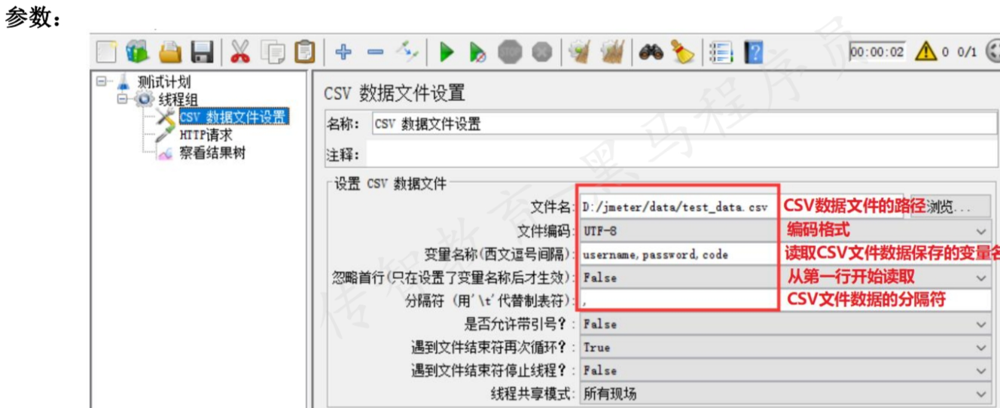

Jmeter进行http接口测试的技术要点(参数化、断言、直连数据库、逻辑控制器、录制脚本)
## Jmeter参数化
### 用户定义的变量
* 作用:定义全局变量
* 位置：测试计划 --> 线程组--> 配置元件 --> 用户定义的变量
* 参数: 
 
1. 什么时候使用用户定义的变量？
* 定义全局变量
2. 使用“用户定义的变量”进行参数化的步骤？
   1. 添加线程组
   2. 添加用户定义的变量。格式：变量名,变量值
   3. 添加HTTP请求，引用定义的变量名。格式：${变量名}
   4. 添加查看结果树
### 用户参数
* 作用：针对同一组参数，当不同的用户来访问时，可以获取到不同的值
* 位置：测试计划 --> 线程组--> 前置处理器 --> 用户参数
* 参数：
  
1. 什么时候使用用户参数？
• 针对同一组参数，当不同的用户来访问时，可以获取到不同的值
2. 使用“用户参数”进行参数化的步骤？
   1. 添加线程组，设置线程数为n（表示模拟的用户数）
   2. 添加用户参数
      * 第一列添加多个变量名
      * 后续每一列为一组用户的数据
   3. 添加HTTP请求，引用定义的变量名。格式：${变量名}
   4. 添加查看结果
### CSV Data Set Config
* 作用:让不同用户在多次循环时，可以取到不同的值
* 位置:测试计划 --> 线程组--> 配置元件 --> CSV 数据文件设置
* 参数:
  
### 函数
**性能测试中如果模拟1000个用户,每个用户执行10万次添加商品操作,请求参数要求不同该怎么做**
* 作用:计数函数
* 位置:在菜单中选择--> 选项 --> 函数助手对话框
* 设置:
  * TRUE，每个用户有自己的计数器；FALSE，使用全局计数器
  * Name of variable in which to store the result (optional):用于存储结果的变量名(可选)
* 使用:生成-复制
  
1. 什么时候使用__counter函数？
   * 自动生成不重复的数据，让每个用户每次循环都能取到不同的数据，且不需要提前定义
2. 使用“counter函数”进行参数化的步骤？
   1. 添加线程组，设置虚拟用户数和循环次数
   2. 生成__counter函数
   3. 添加HTTP请求，使用__counter函数。格式：${__counter(FALSE,)}
   4. 添加查看结果
***
## JMeter参数化总结
1. 什么是参数化
   * 把测试数据组织起来，用不同的测试数据调用相同的测试方法。
2. 4种参数化方式有何不同？如何选择适当的方式？
   1. 用户定义的变量
      * 定义全局变量
      * 局限性:每次取值都**固定**
   2. 用户参数
      * 保证不同的用户针对同一组参数，可以取到不同的值
      * 局限性:同一个用户**多次循环**取到的是**相同**的值
   3. CSV数据文件设置
      * 保证不同的用户及同一用户多次循环时，都可以取到不同的值
      * 局限性:需要**手动**进行测试数据的设置
   4. 函数
      * 保证不同的用户及多次循环时，都可以取到不同的值，不需要提前设置
      * 局限性:输入数据有**特定的业务要求时无法使用**（如：登录时的用户名密码）