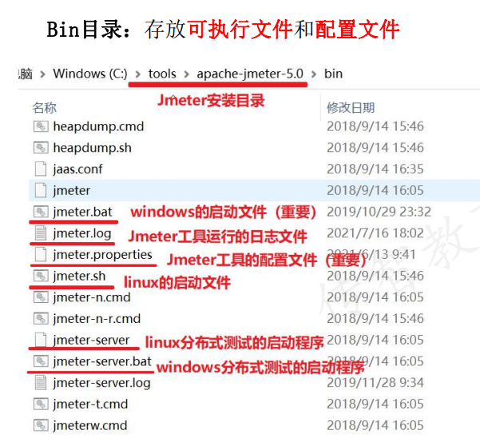
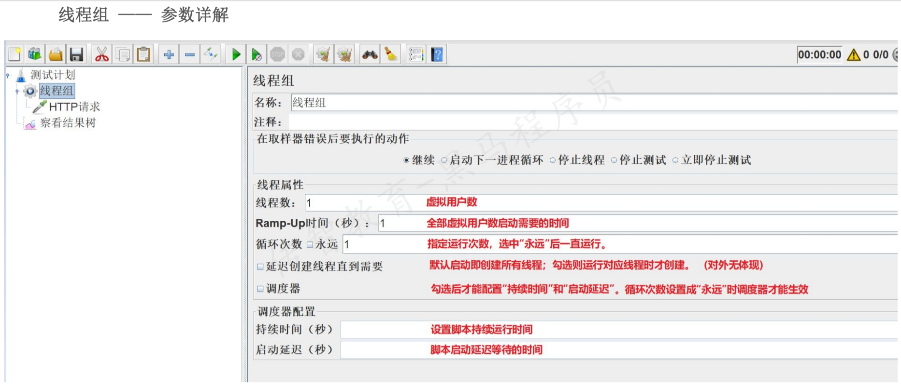

# Jmeter 应用
## Jmeter基本使用
### Jmeter目录介绍
* Bin目录
  * 修改Jmeter配置文件
  * 启动Jmeter程序
  
* lib/ext目录
  * 下载第三方jar包
* printable_docs目录
  * 查找用于手册
***
### Jmeter原件与组件介绍
* **元件:** 多个类似功能组件的容器(类似于类)
  * 取样器:发送请求
  * 逻辑控制器:控制语句的执行顺序
  * 前置处理器:对请求参数进行预处理
  * 后置处理器:对响应结果进行提取
  * 断言:判断接口返回结果是否与预期一致
  * 定时器:设置等待
  * 测试片段:封装一段代码供其他脚本调用
  * 配置原件:测试数据的初始化配置
  * 监听器:查看Jmeter脚本的运行结果
* **组件:** 实现独立的某个功能(类似于方法) 
  * 取样器组件:JDBC Request\http请求
  * 逻辑控制器组件: IF控制器/循环控制器/foreach控制器
#### 与接口自动化脚本的实现过程对应Jmeter哪个组件
1. 接口自动化脚本的实现对应着Jmeter哪个组件
   1. 初始化测试数据  -- 配置原件
   2. 对请求参数进行赋值 -- 前置处理器
   3. 调用请求发送方法 -- 取样器
   4. 提取响应中特定字段的值 -- 后置处理器
   5. 提取出来的值与预期结果进行对比 -- 断言
   6. 在控制台查看脚本运行结果 -- 监听器
2. 元件与组件的关系
   1. 元件:多个类似功能组件的容器(_类似于类_)
   2. 组件:容器中实现独立的某个功能(_类似于方法_)
### 元件作用域和执行顺序
* 元件作用域:靠测试计划中的树形结构中元件的父子关系来确定
  * 所有组件都是**以取样器为核心**来运行的.组件添加的位置不同,生效的取样器也不同
* 作用域原则:
  * 取样器:没有作用域
  * 逻辑控制器:只对其子节点中的取样器和逻辑控制器起作用
  * 其他原件:
    * 如果是某个取样器的子节点,则该元件只对其父节点起作用
    * 如果其父节点不是取样器,则其作用域是该元件父节点下的其他所有后代节点(包括子节点、子节点的子节点等)
* 元件的执行顺序
  * 同一作用域下不同元件`配置元件-前置处理器-定时器-取样器-后置处理器-断言-监听器`
  * 同一作用域下想同元件:从上到下依次执行
***
### 线程组
#### 线程组分类
  * 线程组：普通的、常用的线程组，可以看做一个虚拟用户组，线程组中的每一个线程都可以理解为一个虚拟用户
  * setUp线程组:一种特殊类型的线程组，可用于执行预测试操作
  * tearDown线程组:一种特殊类型的线程组，可用于执行测试后工作
#### 参数详解

### Http请求
**如何配置来发送http请求?**
* 发送GET请求:请求参数在路径中
  * URL:协议、服务器域名或ip、端口、方法GET、路径、编码格式
  * 参数
    * 在路径后添加参数。格式 ?键名=键值
* 发送POST请求:请求参数在**消息体**数据中
  * URL:协议、服务器域名或ip、端口、方法POST、路径、编码格式
  * 参数:
    * 在消息体数据中添加请求体（form/json）
    * 在参数列表中添加参数（form）
### 结果树
* 取样结果：查看响应信息、头信息、响应状态码
* 请求：查看请求相关信息（url、方法、参数）
* 响应：查看响应信息

## Jmeter进行http接口测试的技术要点(参数化、断言、直连数据库、逻辑控制器、录制脚本)
## Jmeter进行性能测试的技术要点(定时器、分布式、测试报告、性能测试图表)