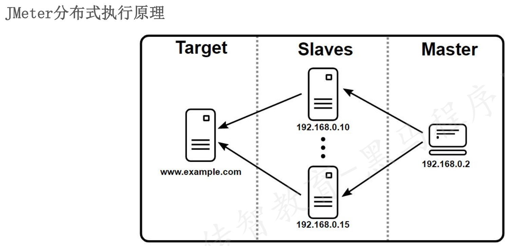

## Jmeter分布式
* 为什么要用分布式
  * 在使用Jmeter进行性能测试时如果项目需要支持10000用户并发但是单台电脑只能支持1000个用户并发该如何处理
* Jmeter分布式执行原理
  - JMeter分布式测试时，选择其中一台作为控制机(Controller)，其它机器做为代理机(Agent)。
    - 执行时，控制机会把脚本发送到每台代理机上
    - 代理机拿到脚本后就开始执行，代理机执行时不需要启动JMeter界面，可以理解它是通过命令行模式执行的。
    - 执行完成后，代理机会把结果回传给控制机，控制机会收集所有代理机的信息并汇总。
 
1. 什么时候需要使用分布式？
   - 单台测试机无法满足用户要求的负载量时，使用多台机器来模拟
2. JMeter分布式测试的原理？
   - 执行时，控制机会把脚本发送到每台代理机上
   - 代理机拿到脚本后就开始执行，接收服务器返回的响应
   - 执行完成后，代理机会把结果回传给控制机
3. JMeter分布式的配置和使用？
* 配置：
   - 代理机：修改服务端口server_port，禁用RMI SSL开关
   - 控制机：配置代理机远程地址remote_hosts，禁用RMI SSL开关
* 使用：
   - 代理机：命令行方式启动，运行jmeter-server.bat文件
   - 控制机：运行jmeter.bat文件，启动JMeter，运行-->远程启动/远程全部启动
***
## Jmeter测试报告
性能测试的各种指标结果如何获取
测试时间较长,如何获取测试过程中的所有指标数据
* 聚合报告
* html测试报告
### 聚合报告
* 作用：收集性能测试结束后，系统的各项性能指标。如：响应时间、并发数、吞吐量、错误率等
* 位置：测试计划->右键->监听器->聚合报告
* 参数介绍：
  - Label：每个请求的名称
  - 样本：各请求发出的数量
  - 平均值：平均响应时间（单位：毫秒）
  - 中位数：中位数，50% <= 时间
  - 90%百分比：90% <= 时间
  - 95%百分比：95% <= 时间
  - 99%百分比：99% <= 时间
  - 最小值：最小响应时间
  - 最大值：最大响应时间
  - 异常%：请求的错误率
  - 吞吐量：吞吐量。默认情况下表示每秒完成的请求数，一般认为它为TPS。
  - 接收 KB/sec：每秒接收到的千字节数
  - 发送 KB/sec：每秒发送的千字节数
### html测试报告
* 作用：JMeter支持生成HTML测试报告，以便从测试计划中获得图表和统计信息
* 命令：
`jmeter -n -t [jmx file] -l [result file] -e -o [html report folder]
eg: jmeter -n -t hello.jmx -l result.jtl -e -o ./repo`
  * 参数描述：
  `  -n：非GUI模式执行JMeter
  -t [jmx file]：测试计划保存的路径及.jmx文件名，路径可以是相对路径也可以是绝对路径
  -l [result file]：保存生成测试结果的文件，jtl文件格式
  -e：测试结束后，生成测试报告
  -o [html report folder]：存放生成测试报告的路径，路径可以是相对路径也可以是绝对路径`
  * 注意：result.jtl和report会自动生成，如果在执行命令时result.jtl和report已存在，必须用先删除，否则在运行命令时就会报错
1. 聚合报告的核心内容有哪些？
   - 响应时间、吞吐量、错误率、网路速率
2. JMeter生成html测试报告的命令？
`jmeter -n -t hello.jmx -l result.jtl -e -o ./report`
   - 注意事项：
   - 如果在执行命令时result.jtl和report已存在，必须用先删除
3. JMeter的HTML测试报告的内容？
   - 性能统计仪表盘
   - 性能测试过程中的详细信息报表