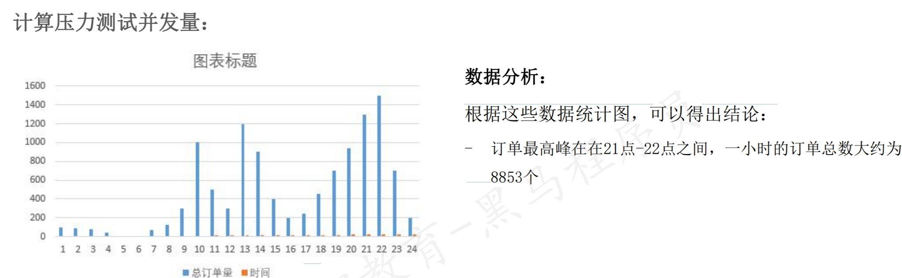

## 性能测试TPS计算
    * 稳定性测试需要模拟用户真实负载量,真实负载量是多少
    * 压力测试时需要模拟高负载验证系统的容错能力,高负载有多高
1. 性能测试时的TPS，大都是根据用户真实的业务数据（运营数据）来计算的
    * 运营数据PV:（Page View）即页面访问量，每打开一次页面PV计数+1，刷新页面也是。PV只统计页面访问次数。
    * 普通计算方法 TPS = 总请求数/总时间
```text
数据分析：
根据数据统计，在2019年第32周，日均PV为4.13万，可以估算为1天有4.13万请求（1次浏览都至少对应1个请求）
总请求数 = 4.13 万请求数 = 41300
总时间 = 1天 = 1 * 24 小时 = 24 * 3600 秒
套入公式：
TPS = 41300请求数/24*3600秒 = 0.48请求数/秒
结论：按照普通计算方法，理论上每秒能够处理0.48请求，就可以满足线上的需要。
```
2. 二八原则计算方法:80%的请求会在20的时间内完成
    * `计算公式: TPS = 总请求数* 80% /总时间*20%`
```text
套入公式：
TPS = 41300 * 0.8请求数 / 24*3600*0.2秒 = 1.91 请求数/秒
结论：按照二八原则计算，在测试环境我们的TPS只要能达到1.91请求数每秒就能满足线上需要。
二八原则的估算结果会比平均值的计算方法更能满足用户需求。
```
3. 计算稳定性测试并发量:
```text
数据分析：
根据这些数据统计图，可以得出结论：
- 大部分订单在8点-24点之间，因此系统的有效工作时长为16
个小时
- 从订单数量统计，8-24点之间的订单占一天总订单的98%左
右（40474个）
```
`结合二八原则计算公式: TPS = 总请求数* 80% /总时间*20%
`- 需要在测试环境模拟用户正常业务(稳定性)操作的并发量为:
- `TPS = 40474 *0.8请求数/16*3600*0.2 = 2.81请求/s `

4. 计算压力测试并发量:
<br>
`计算压力测试的并发数：TPS = 峰值请求数/峰值时间 * 系数：`
- 需要在测试环境模拟用户峰值业务操作（压力测试）的并发量为：
`TPS = 8853请求数/3600秒*3(系数)=7.38请求数/s `
***
**TPS计算总结**
* 并发数计算方法有哪几种？作用有什么区别？
1. 普通方法：
   - 并发数TPS = 总请求数/总时间
   - 作用：可以满足系统最最基本的应用场景（每天的总请求数）的要求。
2. **二八原则：**
   - 并发数TPS = 总请求数 * 80% / 总时间 * 20%
   - 作用：可以满足绝大多数情况下，用户真实的业务场景要求。 
3. 根据业务运营数据的统计计算（通常用来做**稳定性测试**）
   - `并发数TPS = 有效请求数 * 80% / 有效时间 * 20%`
   - 作用：可以满足绝大多数情况下用户真实的业务场景要求(当运营数据的统计越精确，计算结果越准确)
4. 根据用户峰值业务操作来计算（通常用来做**压力测试**）
   - `并发数TPS = 峰值请求数 / 峰值时间 * 系数`
   - 作用：专门用于满足极端的用户业务场景下的性能需求