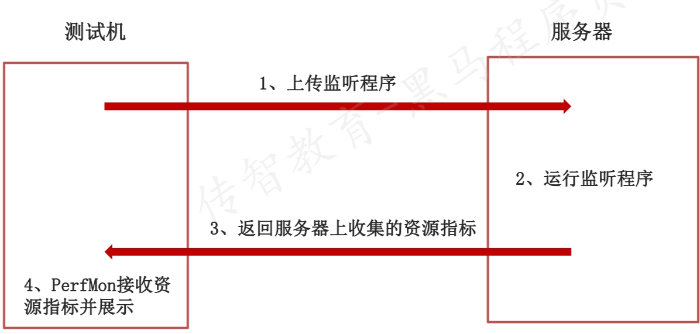

## Jmeter性能测试常用图表
### Concurrency Thread Group 线程组
* 阶梯线程组:作用是阶梯加压；图形界面显示运行状态
* 添加方式:测试计划 --> 线程（用户）--> Concurrency Thread Group
* 参数介绍:
  - Target Concurrency：目标并发（线程数）
  - Ramp Up Time：加速时间
  - Ramp-Up Steps Count：加速步骤计数
  - Hold Target Rate Time：运行时间
  - Time Unit：时间单位（分钟或者秒）
  - Thread Iterations Limit：线程循环次数
  - Log Threads Status into File：日志记录
<br><br>
### Transaction per Second
* 每秒完成事务数：作用是统计各个事务每秒钟成功的事务个数
* 添加方式：测试计划 --> 线程组--> 监听器-->Transactions per Second
### Bytes Throughput per Second
* 每秒字节吞吐量：作用是查看服务器吞吐流量（单位/字节）
* 添加方式：测试计划 --> 线程组--> 监听器-->Bytes Throughput Over Time
1. Concurrency Thread Group 线程组的作用是什么？
   * 阶梯加压
   * 图形界面显示运行状态
2. Transactions per Second和Bytes Throughput per Second有什么作用？
   * Transactions per Second：作用是统计各个事务每秒钟成功的事务个数
   * Bytes Throughput per Second：作用是查看服务器吞吐流量
3. Transactions per Second和聚合报告中的TPS在性能测试时的作用有何不同，以哪个为准？
   * 性能测试的结果统计，以聚合报告的结果为准
   * 每秒性能指标的作用是：查看系统长时间运行过程中是否有异常出现，有则进一步分析
*** 
## PerfMon组件监控服务器资源
作用:用来监控服务端的性能资源指标的工具,包括CPU、内存、磁盘、网络等性能数据
添加方法:线程组->监听器->jp@gc - PerfMon Metrics Collector
注意:使用之前需要在服务端安装监听服务程序并启动
<br><br>

监控性能指标的步骤（linux服务器）：
下载ServerAgent程序，并上传到服务器上
通过finalshell工具上传到指定的目录下
手动启动ServerAgent程序，windows服务器startAgent.bat，linux服务器startAgent.sh
```text
(1)解压缩： unzip ServerAgent2.2.3.zip
(2)进入ServerAgent目录，赋权限：
    cd ServerAgent-2.2.3
    chmod -R 777 *
(3)启动ServerAgent程序
./startAgent.sh
(4) 遇到无法执行java命令的问题--直接安装java环境
yum install java
```
## 总结
1. PerfMon组件的作用？
用来监控服务端的性能资源指标，包括cpu、内存、磁盘、网络等性能数据
2. PerFMon组件监服务器控资源指标的步骤？
   1. 下载ServerAgent-2.2.3.zip，并上传到服务器上进行解压
   2. 启动ServerAgent程序
      * 如果是windows运行startAgent.bat
      * 如果是linux运行startAgent.sh
3. 编写JMeter脚本，配置运行时间
4. 添加PerfMon组件
   * 服务器IP
   * ServerAgent程序端口
   * 待监控的指标

**将windows中的文件上传至linux服务器**
1. 首先安装lrzsz包
`yum install -y lrzsz`
2. linux服务器中输入rz命令
3. 选中你要上传的文件


