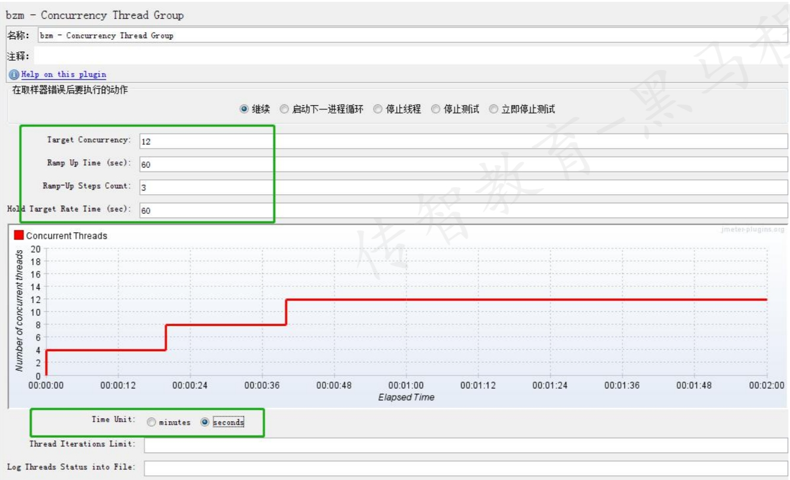

## Jmeter性能测试常用图表
### Concurrency Thread Group 线程组
* 阶梯线程组:作用是阶梯加压；图形界面显示运行状态
* 添加方式:测试计划 --> 线程（用户）--> Concurrency Thread Group
* 参数介绍:
  - Target Concurrency：目标并发（线程数）
  - Ramp Up Time：加速时间
  - Ramp-Up Steps Count：加速步骤计数
  - Hold Target Rate Time：运行时间
  - Time Unit：时间单位（分钟或者秒）
  - Thread Iterations Limit：线程循环次数
  - Log Threads Status into File：日志记录
  
### Transaction per Second
* 每秒完成事务数：作用是统计各个事务每秒钟成功的事务个数
* 添加方式：测试计划 --> 线程组--> 监听器-->Transactions per Second
### Bytes Throughput per Second
* 每秒字节吞吐量：作用是查看服务器吞吐流量（单位/字节）
* 添加方式：测试计划 --> 线程组--> 监听器-->Bytes Throughput Over Time
## PerfMon组件监控服务器资源

