## 性能测试分析调优

1. **步骤:**

* 确定问题。根据性能测试的结果来分析确定bug —— 测试⼈员职责
* 分析原因。分析问题产⽣的原因 —— 开发⼈员职责
* 给出解决⽅案。可以是修改软件配置、增加硬件资源配置、修改代码等—— 开发⼈员职责
* 验证解决⽅案。—— 测试⼈员回归测试
* 分析验证结果 —— 既要保证有问题的指标得到解决,⼜要保证其他指标没有出现新问题
* 性能分析和调优需要经过很多轮,才能最终解决问题

2. 性能测试监控关键指标:
   性能问题可以产生的原因:
    * 服务器的资源 —— 影响应⽤服务器和数据库服务器处理的速率和⽹络传输速率
    * JVM瓶颈分析 —— JAVA程序运⾏的环境
    * 数据库瓶颈分析 —— 数据库程序运⾏环境分析
    * 程序内部实现机制 —— 开发⼈员编写的代码分析
    * 压测机 —— 影响性能结果
***
### 硬件服务器资源指标
1. 服务器硬件
    * CPU
    * 内存
    * 磁盘
    * 运行速度从快到慢: CPU >> 内存 >> 磁盘
    * 存储空间从大到小:磁盘 >> 内存 >> CPU
2. CPU时间介绍
    * CPU:单位HZ
        * 将将CPU划分为若⼲个时间⽚,为每个程序分配对应的时间⽚,保证所有的程序占⽤时间⽚来串⾏执⾏
        * CPU使用率= 已使用的时间片/总时间片*100%
        * 已使用的时间片= ⽤户CPU + 系统CPU
        * 总时间⽚ = ⽤户CPU + 系统CPU + 空闲CPU
        * ⽤户CPU：所有应⽤程序运⾏时消耗的CPU
        * 系统CPU：操作系统运⾏消耗的CPU
    * CPU监控命令: `top` 
      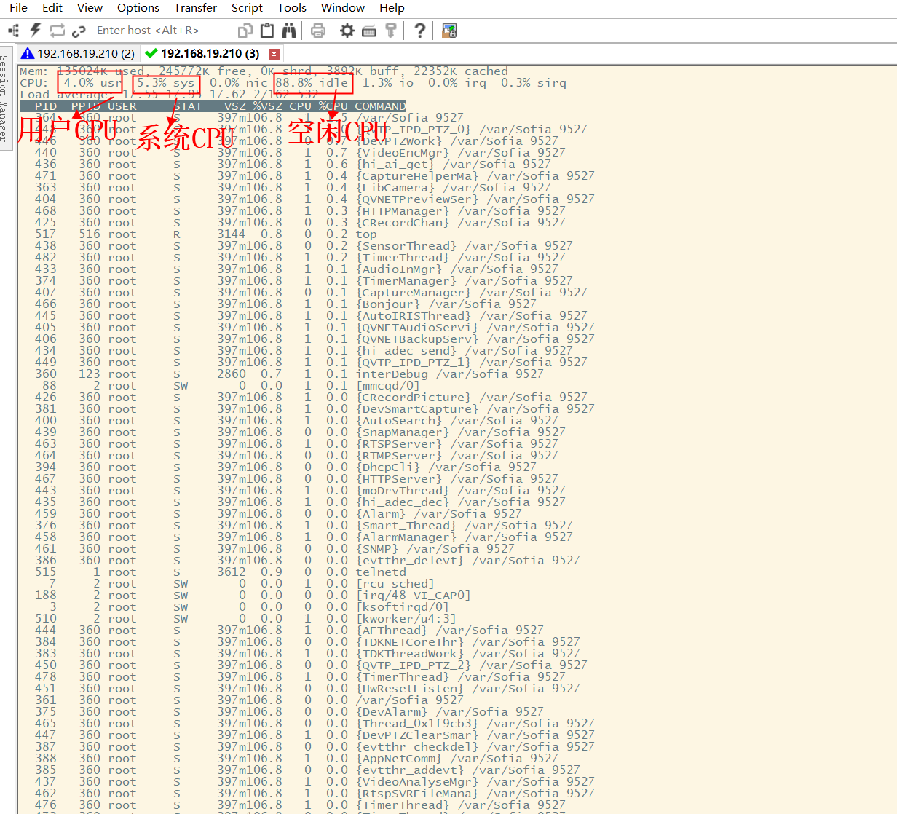 
      **测试关注点**
    * CPU⾼时,需要确认是⽤户CPU⾼还是系统CPU⾼
    * 如果是⽤户CPU⾼,需要进⼀步分析对应的应⽤程序的执⾏效率是否有问题
    * 如果是系统CPU⾼,需要进⼀步观察其他的资源（内存、磁盘、⽹络等）是否存在问题
3. 内存和虚拟内存
    * 内存：实际内存/物理内存,机器实际的内存空间,所有的程序运⾏都必须加载到内存中才能运⾏
    * 虚拟内存：⼀种虚拟化的技术。当内存空间不⾜时,从磁盘中读⼊数据,处理完成后写回磁盘,以此进⾏交换,保证在内存不⾜时,程序也能够运⾏。
    * **注意**
      * 由于虚拟内存,实际上完成了数据在磁盘和内存之间的读写过程,磁盘的速度要远慢于内存时,因此当使⽤虚拟内存时,说明内存已经不⾜,可能存在问题
    * **命令**
      * 查看总量:`top`
      * 查看虚拟内存的使用量:`vmstat` 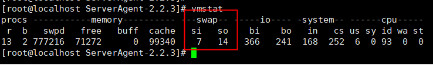 
      * si:每秒从交换区写入到内存的大小
      * so:每秒写入交换区的内存大小
    * 测试关注点:
      * 实际内存：查看内存使⽤百分⽐,检查是否超过80%
      * 虚拟内存：查看swap的si和so长期不为0,说明内存不足(需要大量从虚拟内存和内存中间读来读去,说明内存放不下那么多进程,内存不足)
4. 磁盘IO
    * 关注是磁盘读⼊和写出(Input Output)的速度,不是磁盘⼤⼩。
    * **命令**`iostat -x 1 1` 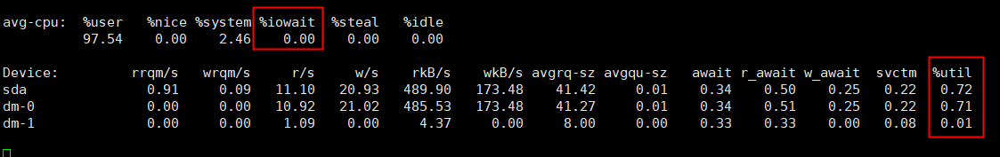 
    * 测试关注点
      * %util(表是一秒中有百分之多少的时间用于I/O)⾼,说明磁盘⻓时间占⽤CPU在发送数据,说明磁盘传输速度不⾜,存在IO瓶颈
      * %iowait(CPU等待输入输出完成时间的百分比)⾼,说明磁盘IO传输数据的任务很多,在等待,说明磁盘传输速度不⾜,存在IO瓶颈
5. 网络
 * 关注的是⽹络传输数据的速度
 * 命令:`sar -n DEV 1 2` 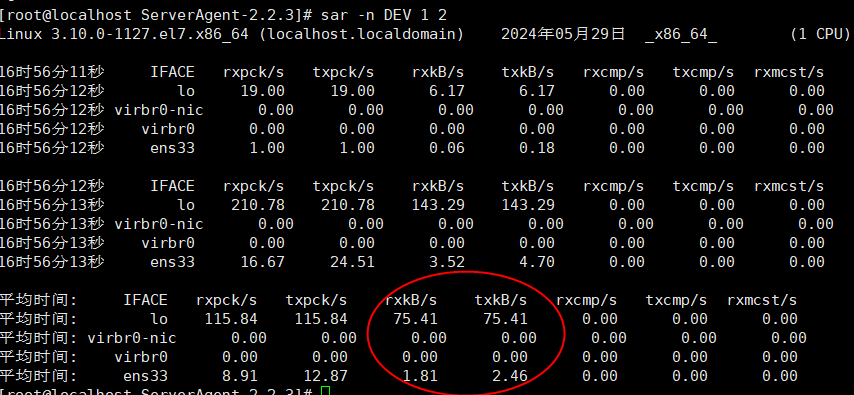 
 * rxkB/s:每秒接收的数据量(千字节数)
 * txkB/s:每秒发送的数据量(千字节数)
 * 测试关注点:实际统计的发送速率和接收速率,与⽹络的总带宽进⾏对⽐,查看使⽤的百分⽐（如果⽆限接近100%,说明存在⽹络性能瓶颈
 * 补充介绍
   * 宽带：⽤户（业务）维度来描述⽹络速率的⽅式。例如：20M宽带、100M宽带、1000M宽带
     * 速率单位：b(bit)/s
   * 带宽：数据在⽹络中传输的速率,在技术中都是通过带宽来描述速率
     * 速率单位：B(Byte)/s
     * 1B = 8bit
   * 实际情况：1000M宽带 —— 对应着的带宽速率为 1000/8 = 125M
***
### 数据库瓶颈
#### 慢查询
* 定义:指执行速度低于设置的阈值的SQL语句
* 作用:帮助定位查询速度较慢的SQL语句,方便更好的优化数据库系统的性能
* MySQL慢查询参数介绍:
  * slow_query_log: 慢查询日志开启状态[ON:开启,OFF:关闭]
  * slow_query_log_file: 慢查询日志存放位置
  * long_query_time: 慢查询时长设置(超过该时长才会被记录,单位：秒)
* 慢查询开启并配置:
  * `mysql> set global slow_query_log='ON';`    -- 开启慢查询日志
  * `mysql> set global slow_query_log_file='/data/slow-query.log';` -- 设置慢查询
  * `mysql> set global long_query_time=1;` -- 设置慢查询时间标准,设置之后会在下次会话生效
  * `show variables like 'slow_query%';` -- 查询日志开启状态以及日志存放地址
  * `show variables like 'long_query_time';` -- 慢查询时长
* 查看慢查询日志:
  * 打开慢查询开关后,就可以记录系统运行时查询时间长的SQL语句,并同步在日志文件中查看慢查询的SQL
  *  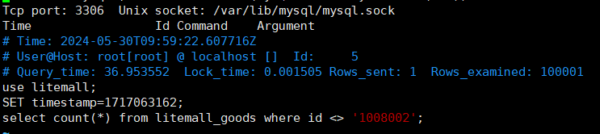 
#### 数据库连接池
* **为什么要使用数据库连接池**
  *  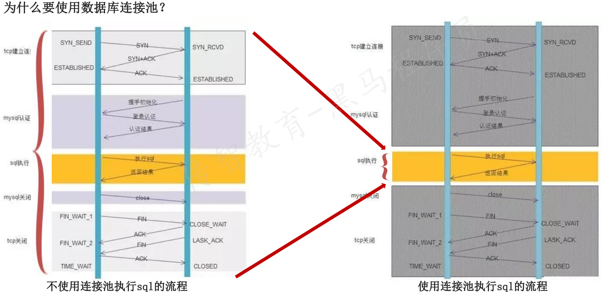 
  * 数据库连接池定义:数据库连接池是负责分配、管理和释放数据库连接,它允许应用程序重复使用一个现有的数据库连接,而不是再重新建立一个
  * 作用:可以提高数据库操作的性能
* **用户使用场景**
  1. 首先查看连接池中是否有空闲连接,如果存在空闲连接,则将连接分配给客户使用;(**最优**)
  2. 如果没有空闲连接,则查看当前所开的连接数是否已经达到最大连接数,如果没达到就重新创建一个连接给请求的客户;(**持平**)
  3. 如果达到就按设定的最大等待时间进行等待(**效率降低**)
  4. 如果超出最大等待时间,则抛出异常给客户(**出错**) 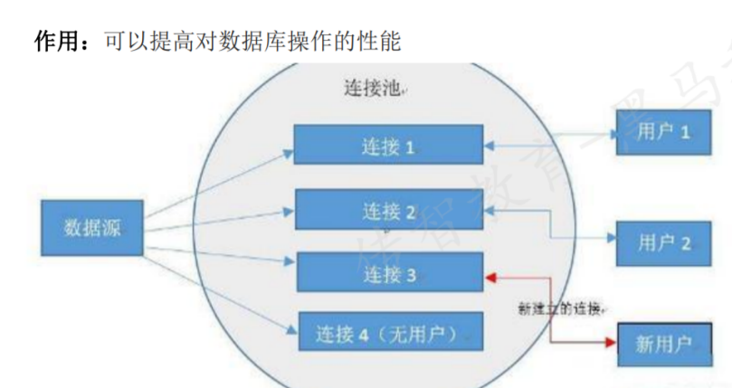 
* 测试关注点
  * MYSQL官网给出了一个设置最大连接数的建议比例：Max_used_connections / max_connections * 100% ≈ 85%,需要关注
  MYSQL的最大连接数 和 系统运行时数据库已建立连接数的比例
  * 如果已使用连接数与最大连接数比例超过85%,需要增加最大连接数设置,否则会造成连接失败
  * 如果已使用连接数与最大连接数比例小于10%,那显然设置的过大,会造成系统资源的浪费
  * `show variables like '%max_connections%';` -- 查看mysql最大连接数  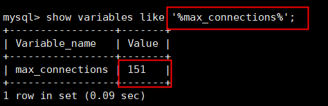 
  * `show status like 'Threads_connected%';` -- 查询当前数据库已建立连接  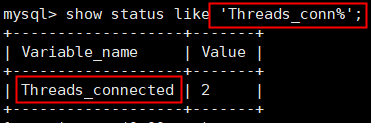 
#### 数据库死锁
* 锁的介绍:
  * 当一个用户修改数据时,对该数据进行加锁操作,其他用户不能进行修改
  * 只有当第一个用户修改完成后,其他用户才能修改
* **MySQL主要有两种锁：表级、行级。**
  * 表级锁：开销小,加锁快；不会出现死锁；锁定粒度最大,并发度最低。
  * 行级锁：开销大,加锁慢；会出现死锁；锁定粒度最小,并发度也最高。
* 死锁：是指两个或两个以上的进程在执行过程中,因争夺资源而造成的一种互相等待的现象。
  * 若无外力作用,它们都将无法推进下去.此时称系统处于死锁状态或系统产生了死锁。
  * 死锁后需要等待很长的时间,要么有程序校验机制来释放,要么手动释放
  * 表级锁不会产生死锁   
* **测试关注点**
* `show open tables where in_use>=1`查看当前正在使用的表(可能是锁定的表)
* `show pricesslist`查看执行时间长的线程,找到对应的sql
* `kill pid`:如果需要先紧急解决问题,可以先手动杀死死锁的连接
*   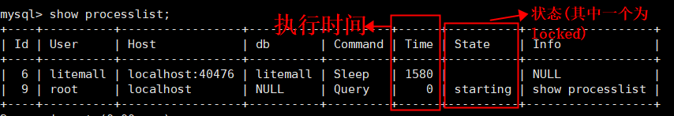 
#### JVM Java应用瓶颈分析 
##### JVM内存
* JVM内存：Java 虚拟机在执行 Java 程序的过程中所管理的不同的内存数据区域。可简单分为：堆内存和非堆内存
  * 堆内存：主要存放用new关键字创建的对象,所有对象实例以及数组都在堆上分配。 —— 给开发人员使用的（关注）
  * 非堆内存：保存虚拟机自己的静态数据,存放加载的Class类级别静态对象如类、方法等。 —— 给JVM自己使用的
* JVM堆内存的管理机制(Java垃圾回收机制)
1. 年轻代存储“新生对象”,我们新创建的对象存储在年轻代中。
2. 当年轻内存占满后,会触发Minor GC,清理年轻代内存空间。
3. 老年代存储长期存活的对象和大对象。年轻代中存储的对象,经过多次GC后仍然存活的对象会移动到老年代中进行存储。
4. 老年代空间占满后,会触发Full GC。Full GC是清理整个堆空间,包括年轻代和老年代  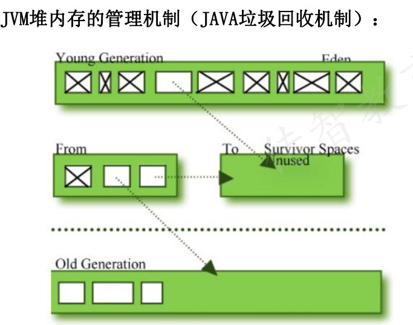 
##### JVM内存分析
* 内存泄漏
  * 内存泄露 memory leak,是指程序在申请内存后,无法完全释放已申请的内存空间。
  * 一次内存泄露危害可以忽略,但内存泄露堆积后果很严重,无论多少内存,迟早会被占光。
* 内存溢出
  * 内存溢出 out of memory,是指程序在申请内存时,没有足够的内存空间供其使用,出现out of memory
  * memory leak最终会导致out of memory
* **测试关注点**
  1. 堆内存使用量持续增长--可能是内存泄漏
  2. Full GC比较慢,执行时会停止程序一些事务的处理。因此Full GC频率不能过高（低于10分钟）
  3. 如果Full GC之后,堆中仍然无法存储对象,就会出现内存溢出——程序出现crash（崩溃)
##### JVM内存监控
**JVM监控 —— 使用本地jvisualvm远程监控服务器：**
1. 添加应用程序启动参数,并启动服务
2. 进入本地jdk安装目录bin目录,找到jvisualvm.exe并启动
3. 右键“远程”选择“添加远程主机”,并输入主机IP
4. 右键主机选择“添加JMX连接”,并输入JMX端口
5. 5.连接成功后在主机下会有对应的连接显示,双击查看监控信息

#### 压测机
* 原因：JMeter单机负载能力有限,如果需要模拟的用户请求数超过其负载极限,也会导致TPS压不上去
* 监控的方法：
  * windows压测机 —— 任务管理器
  * linux压测机 —— PerFMon 或者 top命令
* 解决方法：
  * 添加资源
  * 添加多台压测机,进行分布式测试

