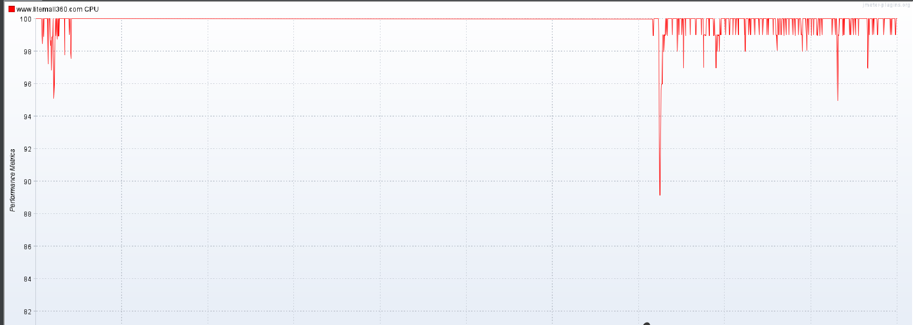

## 性能调优实战
### 案例1
* 分析过程
  * 加载首页的相关数据,包括轮播图,频道、优惠券、团购专区、首发、热卖商品、专题精选等数据
  * 每发送一个HTTP请求需要查询27个SQL语句。当TPS为100时每秒要处理2700个SQL语句 <br><br>
* 解决方案
  * 通过分批次、异步加载的方式，第一次进入首页时只加载第一屏的内容，下拉时再加载后续的数据
  * 增加CPU
### 案例2 慢查询
* 当搜索商品时，慢查询日志中记录了一个查询SQL比较慢，该SQL为获取商品类别信息的SQL
* 
```mysql
select id, `name`, keywords, `desc`, pid, icon_url, pic_url, `level`,
sort_order, add_time, update_time, deleted from litemall_category WHERE ( id in (1008009,1008009,1008009,1008009,1008008,1036000,1036000,1008009,
1008009,1008009,1008007,1008007,1008007, 1008009, 1008008, 1008008, 1015000, 1015000,
1008009, 1008009, 1008009, 1008008, 1036000) and `level` = 'L2' and deleted = 0 and sort_order >= 1 and pid not in(1006000));
```
* 分析步骤：
  * 当搜索关键字匹配到大量的商品时，第3条SQL语句会返回大量重复数据
  * 第4条SQL语句中的in查询条件中同样包含大量重复的商品分类id
  * 因此：第4条SQL会出现查询时间较长,是由于第3条SQL返回的ID有大量重复
* 解决方案
  * 优化第三条SQL语句,y因该SQL语句的查询结果大部分为重复的,可进行去重处理
  * `Distinct` 去重
```mysql
select DISTINCT category_id from litemall_goods WHERE (keywords like '%床%' and is_on_sale = 1 and deleted = 0) or
    ( name like '%床%' and is_on_sale = 1 and deleted = 0 );
```
#### 案例3 JVM内存泄漏:
* 问题分析
  * 测试接口：/wx/index/oom
  * 执行时会出现内存泄漏
  * 开发定位出泄漏的点,修改代码