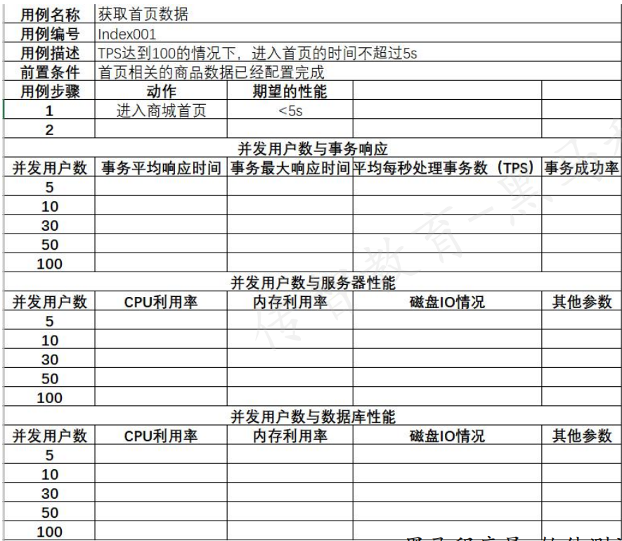

## 性能测试用例设计

## 性能测试用例执行
1. 编写测试脚本
2. 建立测试环境
3. 性能测试监控
4. 执行测试脚本
---
### 常用测试元件：
1. 取样器-HTTP请求
2. 配置元件-HTTP请求默认值
3. 配置元件-用户定义的变量
4. 后置处理器-JSON提取器
5. 断言-响应断言
6. 断言-JSON断言
7. 监听器-察看结果树
8. 监听器-聚合报告
### 掌握如何编写Jmeter测试脚本
Jmeter脚本的基本结构:
1. 创建测试用例结构
2. 设置http请求默认值
3. 用户定义的变量
4. 添加监听器-查看结果树
5. 添加监听器-聚合报告
---
## 搭建性能测试环境
### 性能测试环境的特点：
* 独占性
* 尽量保持性能测试换几个与真实环境一致
  * 硬件环境
    * 服务器环境、网络环境
  * 软件环境
    * 版本一致性:包括操作系统、数据库、被测应用程序、第三方软件等
    * 配置一致性:包括操作系统、数据库、被测应用程序、第三方软件等
  * 使用场景一致性
    * 基础业务数据一致性
    * 业务操作模式一致性:尽量模拟真实场景下用户的使用场景
### 如何构造性测试数据
* 目的:数据量最好和生产环境中保持一致
* 方法:为了快速创建大量数据,可以直接操作数据库进行添加
  * 准备插入数据的SQL语句
  * 循环执行SQL来插入数据
    1. 导包
    2. 连接数据库
    3. 创建游标
    4. 执行SQL语句
    5. 关闭游标
    6. 关闭连接
---
#### 通过编写python脚本构造10w条商品记录
1. 准备插入数据的SQL语句
2. 循环执行SQL语句来插入数据
---
### 如何监控性能测试指标
性能测试的基础指标
1. 系统指标
   1. 响应时间
   2. 并发数
   3. 吞吐量
   4. 错误率
2. 服务器资源指标
   1. CPU使用率:一般可以接受上限85%
   2. 内存利用率:一般可以接受上限85%
   3. 磁盘IO
   4. 网络带宽
### 如何执行性能测试脚本
1. 单台测试机执行：
* 前提：先保证脚本调试通过之后，才能进入正式压测阶段。
* 可以选择Windows或者Linux测试机来执行：
  - Windows环境：操作界面化、直观、易上手，但是软件占用机器资源较多，导致资源使用率不高；可支
  持并发较低。
- Linux环境：命令行操作，结果查看不太方便，但资源利用率相对较高；可支持较高并发。
2. 分布式执行：
   * 如果单台压测机的并发量不能够满足要求，则可以通过分布式压测来提高并发量。
   * JMeter工具支持分布式压测，即多台机器同时执行同一个脚本，然后统计结果。
