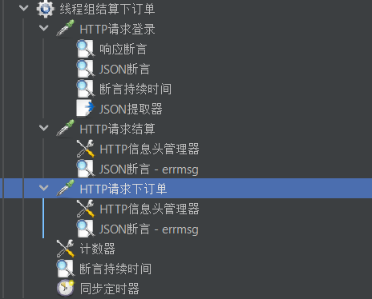
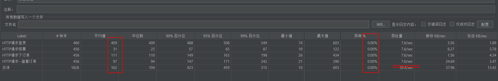
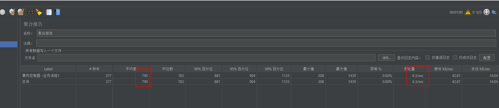

## 性能测试实战 登录

测试失败
 
## 性能测试实战 访问首页

测试通过
## 性能测试实战 添加购物车
添加购物车--查看购物车--商品结算--下订单--查看订单脚本:
1. 数据准备工作
   1. 修改待添加的商品库存为足够大,避免在性能测试过程中把商品库存耗尽导致脚本失败
2. 脚本修改

3. 运行并分析结果
4. 并发10 且TPS达到20 平均响应时间为914ms 小于5s

## 结算并下订单并查看订单
1. 数据准备工作 

   1. 优先准备运行购物车、让cart表里面有充足的数据
   2. 或者直接在购物车表里面插入有效数据`deleted = 0`
2. 脚本修改 

3. 运行并分析结果
4. 并发为5时TPS达到26.5高于标准,异常百分比为0,平均响应时间为187ms 小于3s 
5. 结论：测试通过
 
## 业务流程性能测试
1. 准备测试脚本
2. 修改脚本
3. 添加性能监控
4. 并发执行并分析结果:吞吐量未达标 
5. 在进行业务流程的脚本性能测试时前提必须保证该业务流程中所有的单接口性能测试结果都达标

## 稳定性测试
1. 稳定性测试用例设计
   1. 确定出稳定运行的所有业务操作(同时运行)
   2. 根据运营数据分析出每个业务操作对应的虚拟用户数
2. 稳定性测试执行:
   1. 所有脚本同时执行(接触前后依赖)
   2. 每个脚本都是一个事务/业务--事务控制器
   3. 按照要求设置虚拟用户数和运行时间
   4. 执行稳定性测试并监控
   5. 如果单个接口/业务流程还存在性能bug需要修复性能bug再进行稳定性测试

