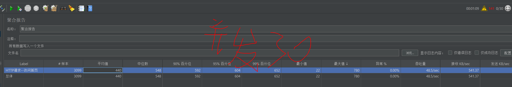

## 性能测试实战 登录

测试失败
 
## 性能测试实战 访问首页

测试通过
## 性能测试实战 添加购物车
添加购物车--查看购物车--商品结算--下订单--查看订单脚本:
1. 数据准备工作
   1. 修改待添加的商品库存为足够大,避免在性能测试过程中把商品库存耗尽导致脚本失败
2. 脚本修改

3. 运行并分析结果
4. 并发10 且TPS达到20 平均响应时间为914ms 小于5s

## 结算并下订单脚本

1. 数据准备工作
   1. 优先准备run购物车
2. 脚本修改

3. 运行并分析结果
4. 并发10 且TPS达到27.7 平均响应时间为654ms 小于5s