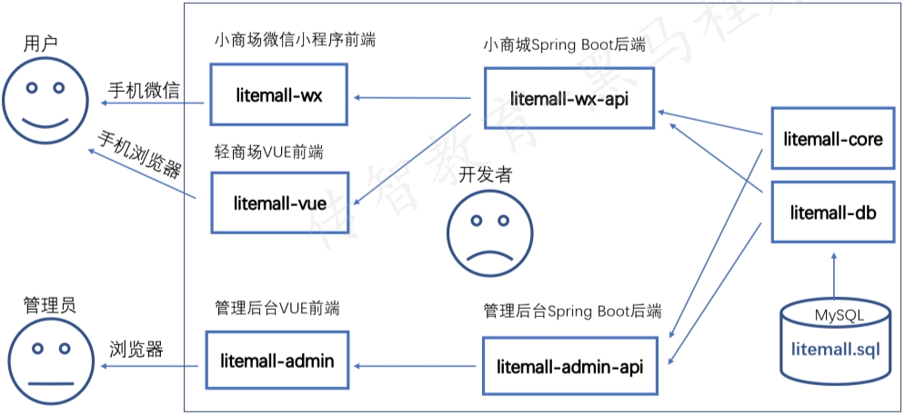
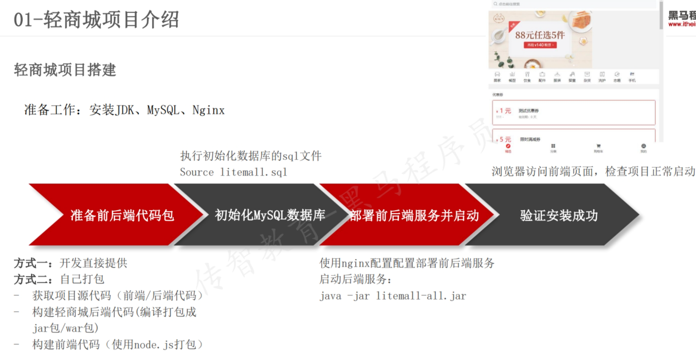
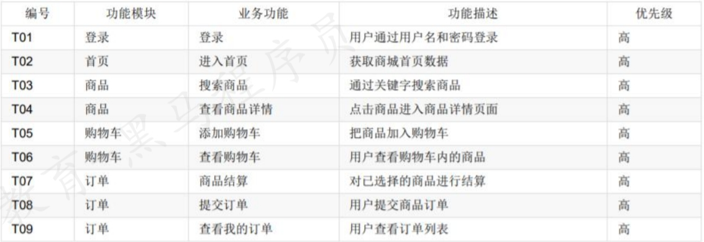
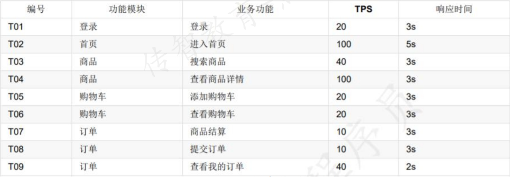
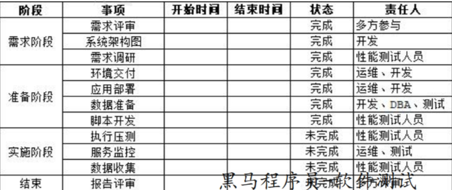

# 轻商城 
## 1. 架构

### 项目功能架构
* 前台商城:购物车,订单,支付,优惠券
* 后台管理系统:商品管理,会员管理,商场管理,推广管理
### 项目技术架构
* 前端:VUE技术框架开发,支持微信小程序,手机移动端,web界面
* 后端:SpringBoot框架开发,Mysql数据库 
 
### 熟悉数据库设计
**作用:**
1. 熟悉数据库设计结构、便于后期对数据库的性能监控、方便问题定位
2. 构造性能测试数据 
 
*** 
## 2. 性能测试需求分析
1. 获取需求
   * 客户方提出：
     - 能够提出明确需求的一般是金融、银行、电信、医疗等企业，他们一般对系统的性能要求高，并且对性能也非常了解
   * 根据历史运营数据分析，如：
     - 用户频繁使用的功能模块是哪些
     - 每月、每周、每天的峰值业务量是多少
   * 竞品分析:
     - 对比同类型软件的性能指标结果
2. 提取性能测试点
    * 业务维度提取:
      * 用户频繁使用的业务功能
      - 非常关键的业务功能
      - 特殊交易日或峰值交易的业务功能
      - 核心业务发生重大调整的业务功能
    * 技术维度提取:
      * 资源占用非常高的业务功能
        
3. 确定性能测试目标(轻商城作为一个新开发项目,性能测试目标包括)
   1. 确定核心业务功能的TPS
   2. 对业务流程(多接口组合)进行压测
   3. 系统能在实际系统运行压力的情况下,稳定运行24小时(稳定性测试) 
 
## 性能测试计划及方案
测试计划核心内容
1. 测试背景
2. 测试目的
   1. 确定核心业务功能的TPS
   2. 对业务流程（多接口组合）进行压测
   3. 系统能在实际系统运行压力的情况下,稳定的运行24小时
3. 测试范围
4. 测试策略:
   5. 基准测试:先做基准测试，确定估算的标准
   6. 负载测试:分别模拟5、10、30、50、100个用户对系统进行负载测试,查看不同并发时系统软件各项指标是否符合需求
   7. 稳定性测试:用200用户对系统进行7*24小时的不间断稳定性测试
5. 风险控制
6. 交付清单
7. 进度分工 
 
