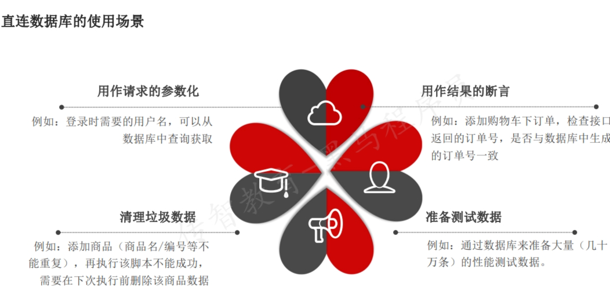

## Jmeter直连数据库
* 用于请求的参数化
* 用作结果的断言
* 准备测试数据
* 清理垃圾数据
  
### 直连数据库的关键配置：
1. 添加MySQL驱动jar包
   - 方式一：在测试计划面板点击“浏览…“按钮，将你的JDBC驱动添加进来
   - 方式二：将MySQL驱动jar包放入到lib/ext目录下，重启JMeter
2. 配置数据库连接信息
   - 添加方式：测试计划 --> 线程组--> (右键添加) 配置元件 --> JDBC Connection Configuration
   - 参数介绍：
     - Variable Name: mysql数据库连接池名称（JDBC请求时要引用）
     - Database URL: jdbc:mysql://192.168.254.131:3306/tpshop3.0?useUnicode=true&characterEncoding=UTF-8
     - 组成：协议 + 数据库IP + 数据库端口 + 连接的数据库名称
     - JDBC DRIVER class: com.mysql.jdbc.Driver（MySQL驱动包位置固定格式 —— 下拉框选择）
     - Username: root(连接数据库用户名，如实填写)
     - Password：（MySQL数据库密码，如实填写，如果密码为空不写）
3. 直连数据库的关键配置：
   1. 添加JDBC请求
      - 添加方式：测试计划 --> 线程组--> 取样器 --> JDBC Request
   2. 参数介绍：
      - Variable Name：数据库连接池的名字，需要与JDBC ConnectionConfiguration的Variable Name Bound Pool名字保持一致
      - Query Type： 
        - 查询操作：选择“Select Statement”
        - 增加、删除、修改操作：选择“Update Statement”
      - Query：填写的SQL语句，未尾不要加“;”
      - Variable names：保存SQL语句返回结果的变量名