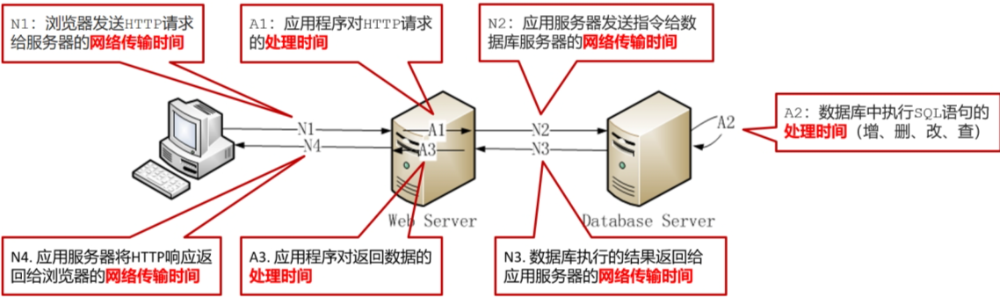
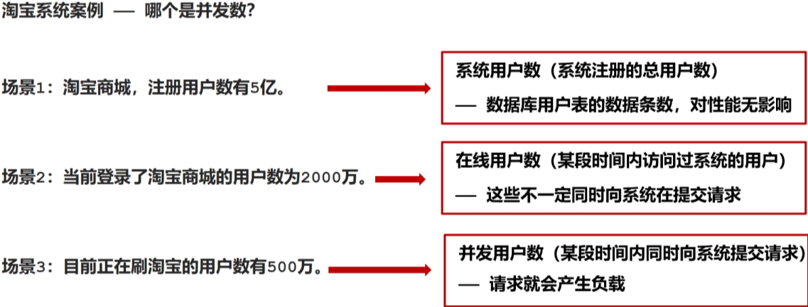
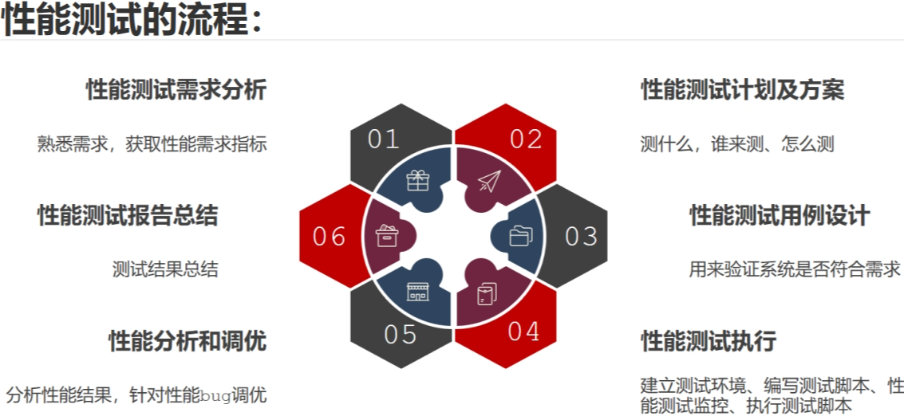
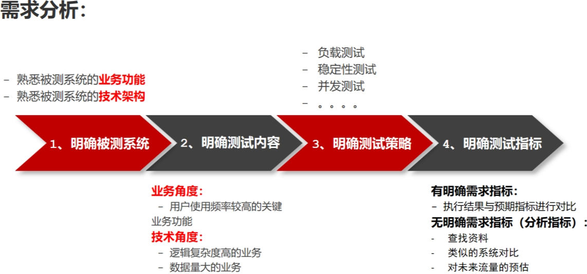
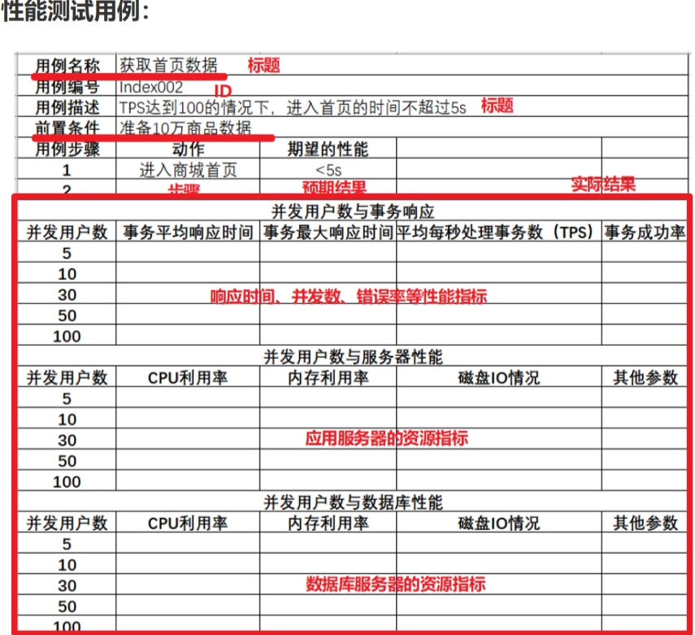
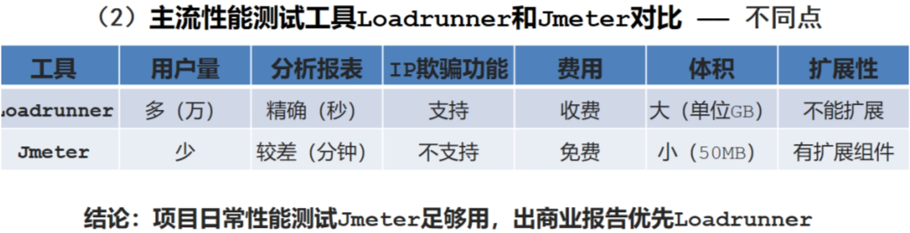

# Jmeter
### 为什么要进行性能测试？
* 真实的商用项目需要大量的用户进行使用,因需要模拟大量用户的使用场景
* 涨价
### 性能的概念
#### 什么是性能
* 时间：系统处理用户请求的响应时间
* 资源：系统运行过程中,系统资源的消耗情况
#### 什么是性能测试
* 使用自动化工具,模拟不同场景,对软件各项性能指标进行测试和评估
#### 性能测试的目的
* 评估当前系统能力
* 寻找性能瓶颈,优化性能
* 评估软件是否能满足未来需求
### 性能测试和功能测试：
1. 区别：
   * 功能：功能需求 焦点：正向、逆向
   * 性能：业务需求 焦点：时间、资源
2. 有什么关系：
   * 先功能，通过后，性能
***
## 性能测试分类：
1. 基准测试：
   * 单用户测试：(单用户多次得到的数据)
   * 建立基准线：(当系统的软硬件环境发生变化时再进行一次基准测试以确定变化对性能的影响) 
   `基准测试数据的用途？`
      * 基准测试不会单独存在
      * 为多用户并发测试和综合场景测试等提供参考依据
      * 为系统/环境配置,系统优化前后的性能提升和下降提供参考指标
2. 负载测试：
   * 概念：通过**逐步增加系统负载**，确定在**满足系统性能指标**(如响应时间等)情况下，找出系统所能承受的**最大负载量**的测试
   * 作用：系统**最大负载量**达到**用户要求**时，系统才能正式上线
3. 稳定性测试
   * 概念：服务器**稳定运行(正常负载)**情况下**长时间测试(one day or week)**,并最终保证服务器能满足线上业务需求
   * 作用：系统在**用户要求的业务负载**下运行达到**规定时间**时,系统才能正式上线使用
## 其他分类
### 压力测试
1. 概念：
   * 在强负载下的测试,查看系统在**峰值情况**下是否功能隐患、系统是否具有良好的**容错能力**和**可恢复能力**
2. 测试场景
   * **极限负载**情况下的**破坏性压力测试**
   * **高负载**下的长时间的**稳定性压力测试**
### 并发测试
1. 概念:
   * 并发测试(绝对并发)：是指在**极短时间**内,发送**多个请求**来验证服务器对并发的处理能力。
2. 应用场景:
   * 特定场景：抢红包、秒杀、抢购
***
## 性能测试的指标
### 响应时间：
* 定义：从客户端发送请求到客户端收到服务器端响应的总时间
* 组成：网络传输时间+服务器处理时间 
  
### 并发用户数：
* 定义：**同一时间**向服务器发送请求的用户数
  
### 吞吐量
1. what is 吞吐量？
* 指的是**单位时间内**处理的**客户端**_请求数量_：直接体现软件性能承载能力。
2. 吞吐量单位有哪些？
* 业务角度：业务数/天、访问人数/天、页面访问量/天
* 网络角度：字节数/小时、字节数/天
* 技术指标：每秒查询数(QPS)、每秒查询事务数(TPS)
3. QPS和TPS有什么关系？
* 事务即业务,**一个事务可以对应一个或多个请求**
* 一个事务对应一个请求时：QPS=TPS
* 一个事务对应多个请求时：QPS=n*TPS
### 点击数
`什么是点击数？`
* 所有**页面元素**(图片、链接、框架)的**请求总数**
* 点击数是<u>请求数</u>,    ~~不是页面上的点击次数~~
### 错误率
* 是指在**负载情况**下,失败业务的概率
* 错误率是性能指标,是在高负载下失败业务的概率
* <u>注意随机bug是功能bug,先解决随机bug才能进行性能测试</u>
### 资源利用率
* `什么是资源利用率？`
  * 系统各个资源的使用情况,**资源使用量/总的资源可用量x100%**
* `常见资源指标有哪些？`
  * CPU使用率: <=75%-85%
  * 内存使用率：<=80%
  * 磁盘IO速率：<=90%
  * 网络速率：<=80%
***
## 性能测试流程：
1. 性能测试需求分析：熟悉需求,获取性能需求指标
2. 性能测试计划及方案：测什么,谁来测,怎么测
3. 性能测试用例设计：用来验证系统是否符合需求
4. 性能测试执行：建立测试环境,编写测试脚本、性能测试监控、执行测试脚本
5. 性能分析与调优：分析性能结果,针对性能bug调优
6. 性能测试报告总结
7. 性能测试需求分析：熟悉需求，获取性能需求指标
 
#### 需求分析：

#### 性能测试用例：

#### 性能测试计划
* 测试的目的和范围
* 测试人员的分工
* 测试时间的安排
* 测试的方法
#### 性能测试执行
- 搭建性能环境
- 编写性能测试脚本
- 配置性能测试监控指标
- 执行脚本
#### 性能测试分析和调优
+ 测试人员负责针对性能的测试结果进行分析是否存在bug，由开发人员进行问题分析和调优
+ 在性能测试的回归过程中，可能需要进行多轮
#### 性能测试报告总结
+ 性能测试过程
+ 性能测试的缺陷分析和调优
+ 性能测试结果
+ 经验总结
#### 性能测试工具
Jmeter/LoadRunner
- 都能模拟大量用户
- 都支持多协议
- 都有监控及分析报表功能 

