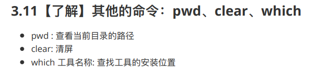
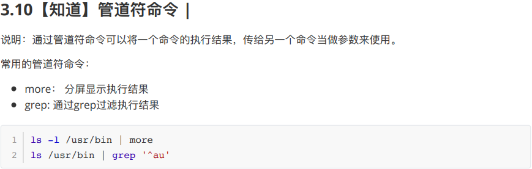
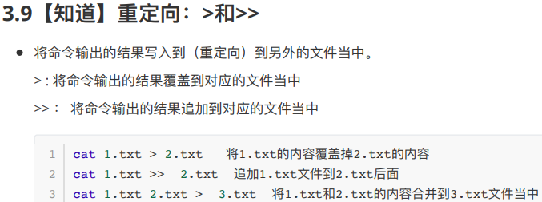
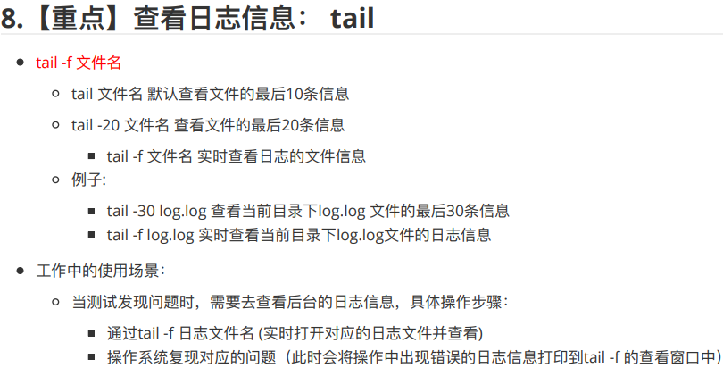
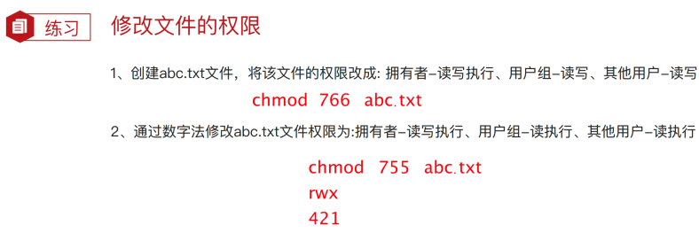
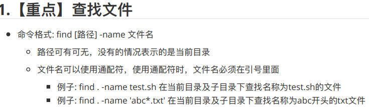
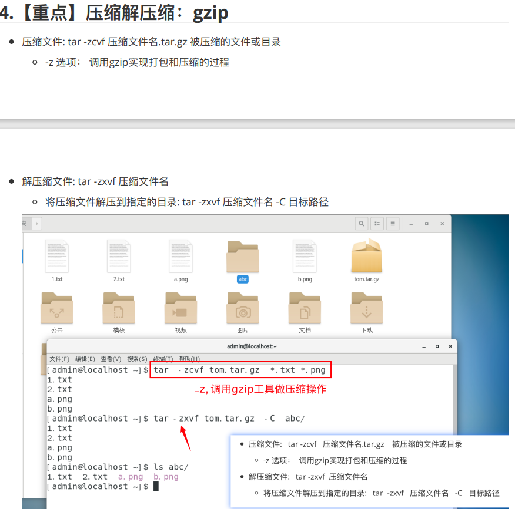

# Linux 基础命令
## 一、连接准备
1. 远程连接（Xshell）
	1. 确定linux中的ssh服务是否开通
		`netstat -anpt | grep  ssh` 
	2. 对方的可控制的ip和端口 
	   `ifconfig 查看ip地址`
	3. 确定对方ip且 可以ping通 
	   `ping ip`
2. 基础命令 
   * -help  查看命令的帮助信息
   * command（命令名称） --help
   * 通过man命令查看帮助信息（）详细
   * man command(命令的名称)
   * 翻页 方向键上下 按q退出
***
## 二、常用的命令
1. **查看目录  ls** (-a 显示所有文件,包括隐藏文件；-lh  h要和l一起使用（文件大小）;-l 以列表显示；-lha 以列表形式所有隐藏文件)
`ls -lha /usr/bin  查看/usr/bin路径下`
	**通配符:**
	`* 匹配0-多个任意字符
	？匹配单个任意字符`
	`[abcd]匹配1/4个字符
	[a-d]a到d的范围内任意一个字符`
2. 创建和删除操作 touch/mkdir/rm
   * touch   创建文件不是文件夹 touch 1.txt 2.txt abc.txt
   * ls -lh /     列出根目录下文件大小
   * ls /bin/*.txt   查看bin目录下的txt文件
3. **切换目录** cd  目录名称（绝对路径有、相对路径）唯一&有参照  （区分大小写)
   * 绝对路径：以根目录和家路径开头，表示从根目录/家目录开始的具体目录位置
   * 相对路径：不以根路径或者家目录开头，表示相对当前目录所在的目录位置 
     * cd . 当前路径
     * cd ./ 当前路径
     * cd .. 回到上一级
     * `cd -` 切换到上一次所在的目录
     * `cd`  或 `cd ~` 切换到当前用户所在的/home/用户目录
4. **mkdir**    创建目录 
如果创建的目录已存在，则创建失败
   * `mkdir -p d1/d2/d3`      递归创建文件夹
   * mkdir mike  在当前路径下新建mike文件夹
   * mkdir /mike 在根目录下新建mike文件夹
5. **rm  删除文件或目录**  -i 提示 -r文件夹  -f不提示 
   * `rm -r mike/`  **删除文件夹专用**
   * rm -ri a/  删除并询问 
   * `rm -rf a.txt`  **删除文件文件夹不提示`**
6. **cp复制粘贴**  cp 源文件  目标文件 
   * cp 1.txt 2.txt
   * `-r:` 若原文件为目录，则复制该目录下所有内容
   * `cp -r tom mike` 复制文件夹tom 并命名问文件夹mike
7. **mv 源文件 目标文件** 
   * `mv a.txt ../m.txt`  将a.txt 移动到上级目录并命名为m.txt
   * `mv m.txt local.txt`  在本目录下将m.txt改名为local.txt
    **复制和移动文件：**
     * `sudo cp /etc/hosts /opt`将etc目录下的hosts文件复制到opt目录下
     * `sudo mv /opt/hosts /etc`将opt目录下的hosts文件移动到etc目录下
8. **查看文件内容：grep**
    * grep搜索文件并显示对应的关键字行信息
      * 命令格式：`grep '关键字'文件名`
      * -v:显示不包含匹配文本的所有行(取反)
      * -n:显示匹配的行和行号
      * -i:忽略大小写
    * grep正则表达式
      * '^a':以a开头
      * 'ke$':以ke结尾
      * `[Ss]igna[LI]`:匹配[]中的任意一个字符,搜寻匹配单词为Signal等
      `grep -n '[Ss]igna[LI]' test.txt`
9. 查看文件内容：`cat、more`
   * cat命令用来查看文件内容较少的文件
   * more命令：查看文件内容较多的文件,命令格式：more 文件名
     * 空格显示下一页
     * enter：滚动显示下一行
     * b键：显示上一页内容
     * f键：显示下一页内容
     * q键：退出
10. pwd clear which 

11. _管道符命令|_
    **将命令的执行结果传给另一个命令当参数** 

12. 重定向 `>   >>` 
    * `>`将命令输出的结果覆盖到对应的文件当中
    * `>>`将命令输出结果追加到对应的文件中 

***
## 三、信息系统相关命令
1. 重启关机
    * 重启命令：reboot
    * 关机命令：shutdown
2. **查看系统进程：ps**
    * 命令格式：ps -aux | grep '关键字' eg:`ps -aux | grep sedispatch`
    * 选项说明：
      * -a：显示所有用户进程
      * -u：显示进程详细状态
      * -x：显示没有控制终端进程
3. 查看系统的进程信息：top
4. **关闭进程：kill**
   * 命令格式：kill -9 进程ID
     * 进程id会通过ps命令查看
     * -9是强制关闭
5. **查看系统监听端口：** netstat [-anptu] | grep 关键字
   * 查看3306端口是否打开：`netstat -anptu | grep 3306`
   * 查看http服务是否打开：`netstat -anptu | grep http`
   * 查看TCP协议端口是否打开：`netstat -anpt`
6. **查看日志信息：tail**
   * tail 文件名：默认查看最后10条信息
   * tail -f 文件名:查看文件的实时信息
   * tail -20 文件名：查看文件最后20条信息 
   
7. **修改用户权限chmod：** 数字法
   * chmod 755 文件名 
    
   
8. **查找文件：** find [路径] -name 文件名
   * `find . -name test.sh` 在当前目录及子目录下找test.sh文件
   * `find . -name 'abc*.txt'` 
    
9. **压缩与解压缩：gzip**
   * 压缩：`tar -zcvf 压缩文件名.tar.gz 被压缩的文件或目录`
     * -z:调用gzip 实现打包和压缩过程
   * 解压缩：`tar -zxvf 压缩文件名 -C 目标路径` 

   
  