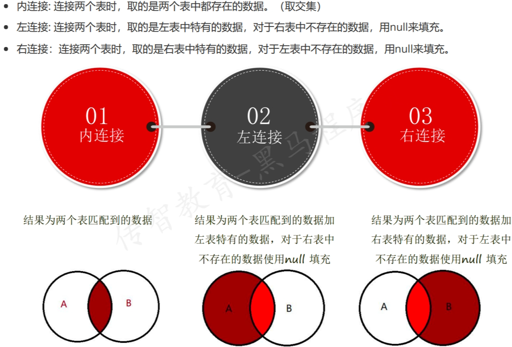

# 连接查询
## 连接查询概述
* 内连接:连接两个表时,取两个表中都存在的数据,取交集
* 左连接:连接两个表时,取左表中特有的数据,对于右表中不存在的数据用null来填充
* 右连接:连接两个表时,取右表中特有的数据,对于左表中不存在的数据用null来填充


**数据准备**
```sql
CREATE TABLE courses(
courseNo INT(10) UNSIGNED PRIMARY KEY auto_increment,
name VARCHAR(10)
);
SELECT * from courses;

insert into courses VALUES ('1','数据库'),('2','qtp'),('3','linux'),
('4','系统测试'),('5','单元测试'),('6','测试过程');

drop table if exists scores;
show tables;
create table scores (
id int(10) unsigned primary key auto_increment,
courseNo int(10),
studentno varchar(10),
score tinyint(4)
);

insert into scores values ('1', '1', '001', '90'), ('2', '1', '002', '75'),
('3', '2', '002', '98'),('4', '3', '001', '86'),('5', '3', '003', '80'),
('6', '4', '004', '79'),('7', '5', '005', '96'),('8', '6', '006', '80');

SELECT * from scores;
```